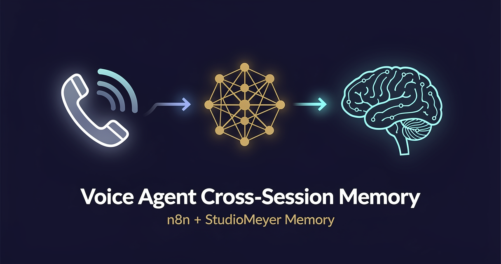

<!-- studiomeyer-mcp-stack-banner:start -->
> **Part of the [StudioMeyer MCP Stack](https://studiomeyer.io)** · Built in Mallorca · ⭐ if you use it
<!-- studiomeyer-mcp-stack-banner:end -->

# Voice Agent with Cross-Session Memory (Multi-Provider)

> Recognize callers across calls. Reference what they said yesterday. Stop asking returning customers their email three times. **Pick your LLM** (OpenAI default, Anthropic alternative, extensible to any provider).



## What this does

A voice provider (Vapi, Retell, Bland, or any custom telephony bridge that posts JSON) sends a webhook when a call ends. The workflow looks up the caller's phone in StudioMeyer Memory, retrieves prior interactions, builds a context-aware prompt, and replies through the LLM **you choose** (default: OpenAI gpt-5-mini, alternative: Anthropic Claude Haiku 4.5). After the reply is sent, it persists the new observation back to memory.

The result is a voice agent that knows your customer the second time they call. No vector-database setup, no Postgres extension, no manual schema work, just one credential and three minutes to import.

## Multi-Provider Switch

The workflow has a `Set Provider` node followed by a `Route by Provider` switch. Default value is `openai`. Change to `anthropic` (or add your own branch with a third LLM) without rebuilding the rest of the flow. Both branches converge in `Normalize LLM Output` which extracts the reply text from either provider's response shape and feeds it to the response + memory writes.

To add a third provider (e.g. Gemini, Mistral, local Ollama):

1. Open the `Route by Provider` Switch node, add a third rule matching e.g. `provider == "gemini"`.
2. Drag in the corresponding LLM node (or HTTP Request for self-hosted), connect it to the new switch output.
3. Connect the new LLM node back to `Normalize LLM Output`.
4. The Code node already handles common shapes; if the new provider returns something exotic, add one more `else if` branch.

Memory writes stay identical regardless of provider, they pull `replyText` from the normalized output, not from the provider-specific node.

## Architecture

```
[Vapi/Retell Webhook]
        │
        ▼
[Normalize Payload]               ← parses E.164 phone, transcript, call ID
        │
        ▼
[Memory: Lookup Caller]           ← entity.search, entityType=caller
        │
        ▼
   ┌──┤ Known Caller? ├──┐
   │                     │
   ▼ yes                no ▼
[Memory: Recent Context]   [Memory: Create Caller]
   │                     │
   └────────┬────────────┘
            ▼
[Build LLM Prompt]                ← injects past context into system prompt
            │
            ▼
[Set Provider]                    ← provider = "openai" (default) | "anthropic"
            │
            ▼
[Route by Provider]
            │
   ┌────────┴────────┐
   ▼ openai          ▼ anthropic
[OpenAI Reply]     [Anthropic Reply]
   │                  │
   └────────┬─────────┘
            ▼
[Normalize LLM Output]            ← extracts replyText from either shape
            │
   ┌────────┼─────────────┐
   ▼        ▼             ▼
[Respond]  [Memory: Observe]  [Memory: Learn]   ← async, no latency impact
```

## Memory model

| Concept | Storage | Key |
|---|---|---|
| Caller identity | `Entity` of `entityType: caller` | normalized phone (E.164) |
| Per-call detail | `Observation` on the caller entity | timestamp + transcript snippet + agent reply |
| High-level outcome | `Learning` (category: insight) | tagged with `voice-agent` + `caller-<phone>` |

This three-layer model means you can later run `entity.open` to get a full caller dossier, `memory.search` with `recencyWeight: 0.5` to pull recent decisions, or `insight.synthesize` to generate a weekly summary across all callers.

## Setup

1. **Install the StudioMeyer Memory community node** in your n8n instance:
   ```bash
   # Self-hosted
   npm install n8n-nodes-studiomeyer-memory
   # n8n Cloud / hosted: Settings → Community Nodes → Install package: n8n-nodes-studiomeyer-memory
   ```

2. **Get an API key** at [memory.studiomeyer.io/dashboard/keys](https://memory.studiomeyer.io/dashboard/keys). Create a credential in n8n: *Credentials → New → StudioMeyer Memory API → Auth Mode: API Key*.

3. **Import the workflow.** In n8n: top-right menu → *Import from clipboard* → paste `workflow.json` → *Import*.

4. **Add an LLM credential.** Default is OpenAI (Credentials → New → OpenAI API). If you'd rather use Claude, add an Anthropic credential instead and change the `Set Provider` node value from `openai` to `anthropic`. You can have both credentials installed and switch between them by editing one node.

5. **Activate the workflow.** The webhook node now exposes a Production URL of the form `https://your-n8n.example.com/webhook/vapi-callback`.

6. **Wire the webhook into your voice provider.**
   - **Vapi:** Dashboard → Assistants → your assistant → Server URL → paste the production URL. Set *Server URL Events* to include `end-of-call-report`.
   - **Retell:** Dashboard → Agents → your agent → Webhook URL → paste. Set events to `call_ended`.
   - **Custom telephony:** POST a JSON payload with `caller_phone` and `transcript` fields. The Code node will normalize either Vapi or Retell shapes; for a third format, edit the two `body?...` extractors at the top.

7. **Test.** Call your voice number. End the call. The first call creates the caller entity. The second call retrieves it and the system prompt now contains the prior interaction summary. Verify in [memory.studiomeyer.io](https://memory.studiomeyer.io) → *Knowledge Graph* → search for the caller's phone number.

## Extending

**Add caller scoring.** After `Memory: Lookup Caller`, branch on observation count. Callers with 5+ prior interactions get a different greeting ("Welcome back, this is your sixth call!"). Use `entity.open` to fetch the full observation list.

**Hand off to a human.** Add an IF node after Claude that checks for sentiment keywords ("frustrated", "speak to a manager"). Branch into a Slack notification with the caller's history pre-formatted, so the human takes over with full context.

**Multi-language replies.** Add a language-detection step before `Build LLM Prompt`. Store the detected language as an observation on the caller entity. Subsequent calls use the stored preference automatically.

**Daily caller-list synthesis.** Add a separate scheduled workflow that runs `Memory: Synthesize` every morning with `query: "voice-agent recent calls"` and posts the cluster summary to your team Slack. The voice agent's data becomes a CRM-lite without any extra plumbing.

## Cost notes

Per call (assuming ~30s of conversation, average payload):

| Component | Approx cost |
|---|---|
| 2× Memory operations (search + learn) | < $0.001 (well within free tier) |
| 1× Claude Haiku 4.5 call (~500 tokens) | ~$0.0005 |
| 1× entity.observe (async) | < $0.001 |
| **Total per call** | **~$0.002** |

At 1 000 calls/month, expect ~$2/month in LLM + memory cost. The free Memory tier covers ~10 000 ops/month; upgrading to the EUR 29/mo Pro tier unlocks unlimited ops + the 3D knowledge-graph view.

## Common gotchas

- **No phone in payload.** Some Vapi setups send `caller=anonymous` or strip the number. The Code node handles this gracefully (`hasPhone: false`) but the IF branch will treat it as a new caller every time. Add a fallback to use the Vapi `call.id` as a synthetic identifier if you need recognition for anonymous callers.
- **Transcript is empty for short calls.** Vapi sends `end-of-call-report` even for 2-second calls where nothing was said. The IF branch still fires, the LLM still replies (with an empty user message). Either add a guard in `Normalize Payload` to skip when transcript is empty, or accept the noise.
- **Multiple calls in flight.** n8n's default execution mode is fire-and-forget per webhook trigger. If the same caller calls twice in 30 seconds, both runs will see "0 entities" on the first lookup (race condition). Memory's gatekeeper deduplicates on the entity-create side, so you don't get duplicate `caller` entities, but the second call's "first call" observation is technically wrong. For high-volume use, switch the entity-create branch to `entity.observe` with a fallback that auto-creates the entity if missing (this is a Memory v3.17 feature, currently in private beta).

## Related templates

- [02 - AI Customer Support with Customer History](../02-customer-support-with-history/) · same memory pattern for chat platforms (Telegram, WhatsApp, Slack)
- [03 - Personal Assistant with Long-Term Memory](../03-personal-assistant-long-term-memory/) · single-user variant with intent classifier and tool use

---

*Built by [StudioMeyer](https://studiomeyer.io) in Mallorca. Part of the [StudioMeyer MCP Stack](../../README.md). Memory at [memory.studiomeyer.io](https://memory.studiomeyer.io). Issues + ideas at [github.com/studiomeyer-io/n8n-templates/issues](https://github.com/studiomeyer-io/n8n-templates/issues).*
