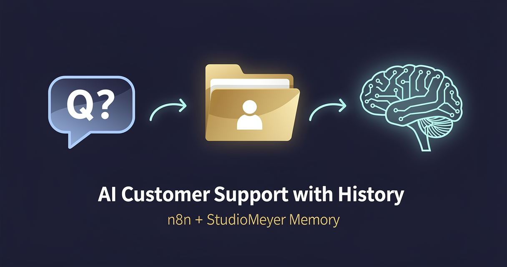

<!-- studiomeyer-mcp-stack-banner:start -->
> **Part of the [StudioMeyer MCP Stack](https://studiomeyer.io)** · Built in Mallorca · ⭐ if you use it
<!-- studiomeyer-mcp-stack-banner:end -->

# AI Customer Support with Customer History (Multi-Provider)

> Returning customers don't have to start from scratch. The bot greets them by name, references their last ticket, and your human agents take over with the full file. **Pick your LLM** (OpenAI default, Anthropic alternative).



## What this does

A customer messages your Telegram bot (or WhatsApp Cloud API, or Intercom, the trigger is swappable). The workflow extracts a stable customer key from the message (email if visible, otherwise the Telegram user ID), looks up that customer in StudioMeyer Memory, retrieves their full dossier, and asks Claude to reply with the dossier as system-prompt context.

After the reply is sent, two async writes persist the new ticket as an observation on the customer entity and a high-level learning that's searchable across your support corpus.

The bot now has institutional memory. The third time a customer writes "my login isn't working" you can spot the pattern automatically.

## Architecture

```
[Telegram Trigger]
        │
        ▼
[Extract Customer Key]            ← email regex; fallback to Telegram user ID
        │
        ▼
[Memory: Lookup Customer]         ← entity.search, entityType=customer
        │
        ▼
   ┌──┤ Known Customer? ├──┐
   │                       │
   ▼ yes                  no ▼
[Memory: Customer Dossier]   [Memory: Create Customer]
   (entity.open, full file)   (with first observation)
   │                       │
   └────────┬──────────────┘
            ▼
[Build LLM Prompt]                ← injects dossier into system prompt
            │
            ▼
[Claude Reply]                    ← Claude Sonnet 4.6
            │
   ┌────────┼────────────────┐
   ▼        ▼                ▼
[Telegram Reply]  [Memory: Observe]  [Memory: Learn]
                  (per-ticket)        (corpus-wide insight)
```

## Memory model

| Concept | Storage | Key |
|---|---|---|
| Customer identity | `Entity` of `entityType: customer` | email (if extractable) else `tg:<user_id>` |
| Per-ticket detail | `Observation` on the customer entity | timestamp + question snippet + bot reply snippet |
| Corpus learnings | `Learning` (category: insight) | tagged with `support` + `customer-<key>` |

The dual write (observation + learning) costs you one extra memory op per ticket but unlocks two very different lookups:

- **Per-customer view** (`entity.open`): "Show me everything about acme@example.com." Returns the full dossier in one call.
- **Corpus view** (`memory.search`): "What login issues did we see this week?" Searches across all customers, ranked by recency + relevance.

## Setup

1. **Install the StudioMeyer Memory community node** (see repo README).

2. **Create a Telegram bot.**
   - Message @BotFather on Telegram, type `/newbot`, follow the prompts.
   - Save the token (looks like `123456789:ABC-DEF...`).

3. **Add credentials in n8n:**
   - StudioMeyer Memory API → API Key from [memory.studiomeyer.io/dashboard/keys](https://memory.studiomeyer.io/dashboard/keys).
   - Telegram → paste the bot token.
   - Anthropic API → free-tier key works; this template uses Sonnet 4.6 for richer replies.

4. **Import the workflow** (`workflow.json` in this folder).

5. **Activate** the workflow. Telegram automatically registers the webhook.

6. **Test** by messaging your bot. The first message creates a customer entity. Subsequent messages show the dossier in the LLM prompt, verify by checking the *Build LLM Prompt* node's output after a second message.

## Swap Telegram for WhatsApp / Intercom / web chat

Replace two nodes; the middle 8 stay identical:

| Provider | Trigger node | Reply node |
|---|---|---|
| **WhatsApp Cloud API** | WhatsApp Trigger (built-in) | WhatsApp Send Message |
| **Intercom** | Webhook (manual), Intercom posts to your URL | HTTP Request to Intercom Conversations API |
| **Custom web chat** | Webhook | Respond to Webhook |
| **Slack** | Slack Trigger | Slack Send Message |

In each case, update the `Extract Customer Key` Code node to read the right field for customer identity (e.g. WhatsApp `from`, Intercom `user.email`, Slack `user.id`).

## Extending

**Hand off to humans on demand.** Add a sentiment-check IF after Claude. If the reply suggests escalation ("I'd recommend speaking with a manager"), post the customer's full dossier into a #support Slack channel with a button that mutes the bot for that customer for 24h.

**Pattern detection.** Add a weekly scheduled workflow that runs `Memory: Synthesize` with `query: "support recent issues"`. The synthesis clusters tickets by topic and posts the top 5 patterns to your team's morning brief, you'll spot recurring product issues that single tickets hide.

**Pre-fill CRM contact.** When a new customer entity is created, fan out to the [StudioMeyer CRM](https://crm.studiomeyer.io) MCP server and create a contact with the email + first message. Now your sales team gets a contact record before the bot even finishes replying.

**Multi-language.** Add a language-detection step before `Build LLM Prompt`. Store the detected language as an observation. The system prompt then instructs Claude to reply in the customer's language.

## Cost notes

Per ticket (1 customer, ~200-word reply):

| Component | Approx cost |
|---|---|
| 2× Memory operations (lookup + open) | ~$0.0008 |
| 1× Claude Sonnet 4.6 (~600 tokens out) | ~$0.005 |
| 2× async memory writes | ~$0.001 |
| **Total per ticket** | **~$0.007** |

At 5 000 tickets/month → ~$35/month all-in. The free Memory tier covers ~10 000 ops/month; the EUR 29/mo Pro tier removes that cap and unlocks the 3D customer-relationship graph.

## Common gotchas

- **No email in message.** Customers rarely identify themselves up-front. The Telegram-ID fallback works, but it produces one entity per Telegram account, not one per real human (a customer who has two accounts looks like two people). Mitigation: when an email IS provided in a later message, run a separate workflow that uses `entity.relate` to merge the `tg:<id>` entity into the email entity.
- **Markdown rendering.** Telegram parses Markdown but only a subset (no tables, limited links). The `parse_mode: Markdown` field works for bold/italic; if you need richer formatting, switch to `MarkdownV2` and escape special characters in the reply text.
- **Bot rate limit.** Telegram bots get throttled at ~30 messages/sec across all chats. For high-volume scenarios, use the WhatsApp Cloud API or batch replies.
- **Duplicate observations on retry.** If n8n retries the workflow, the entity-observe step might write the same ticket twice. Memory's gatekeeper deduplicates on >95% similarity, so identical observations get skipped automatically. For belt-and-suspenders, add an idempotency key based on the Telegram `message_id` and short-circuit before the observe step.

## Related templates

- [01 - Voice Agent Cross-Session Memory](../01-voice-agent-cross-session-memory/) · same memory pattern over telephony (Vapi / Retell)
- [03 - Personal Assistant with Long-Term Memory](../03-personal-assistant-long-term-memory/) · single-user variant with intent classifier and tool use

---

*Built by [StudioMeyer](https://studiomeyer.io) in Mallorca. Part of the [StudioMeyer MCP Stack](../../README.md). Memory at [memory.studiomeyer.io](https://memory.studiomeyer.io). Issues + ideas at [github.com/studiomeyer-io/n8n-templates/issues](https://github.com/studiomeyer-io/n8n-templates/issues).*
