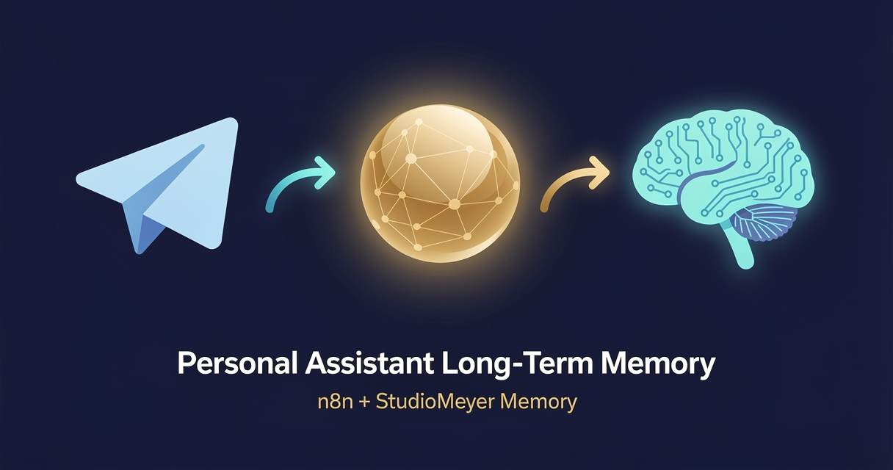

<!-- studiomeyer-mcp-stack-banner:start -->
> **Part of the [StudioMeyer MCP Stack](https://studiomeyer.io)** · Built in Mallorca · ⭐ if you use it
<!-- studiomeyer-mcp-stack-banner:end -->

# Personal Assistant with Long-Term Memory (Multi-Provider)

> Tell it anything, ask it anything later. Notes, decisions, half-formed thoughts, they all become searchable. "What did I say about the redesign on Monday?" returns the right answer three weeks later. **Pick your LLM** (OpenAI default, Anthropic alternative).



## What this does

A single-user Telegram bot with three intents:

- **Note** (`/note <anything>` or just text): stored as a Memory learning. No LLM call. Reply: "Saved."
- **Ask** (`/ask <question>` or any non-slash text): searches Memory with recency-weighting, builds a context-aware prompt, lets Claude answer with citations to past entries.
- **Summary** (`/summary <topic>`): runs Memory's `synthesize` operation, clusters everything tagged with that topic into a coherent summary.

The killer feature is the third one. After three weeks of notes about a project, `/summary redesign` returns a paragraph that reads like you wrote it yourself, because it was generated from your own words.

## Architecture

```
[Telegram Trigger]
        │
        ▼
[Detect Intent]                   ← slash-command parse, default = ask
        │
        ▼
   ┌──┤ Route by Intent ├──┐
   │      │      │      └─── fallback (treated as ask)
   ▼      ▼      ▼
 note   summary  ask
   │      │      │
   ▼      ▼      ▼
[Save] [Synthesize] [Search]
   │      │      │
   ▼      ▼      ▼
[Reply]  [Reply]  [Build Prompt → Claude → Reply + Learn]
                  (memory written async)
```

## Memory model

| Concept | Storage | Tags |
|---|---|---|
| Notes | `Learning`, category=insight, confidence=0.85 | `note, <user-label>` |
| Q&A pairs | `Learning`, category=insight, confidence=0.65 | `qa, <user-label>` |
| Summaries | Generated on-demand from existing learnings | n/a |

The asymmetric confidence (notes 0.85, Q&A 0.65) is deliberate. Notes are things you said with intent, Q&A pairs include your phrasing of a question and the LLM's answer, which is useful but slightly less authoritative.

All memory is scoped to `project: personal-assistant` so it doesn't mix with your work memory if you use Memory in multiple workflows.

## Setup

1. **Install the StudioMeyer Memory community node** (see repo README).

2. **Create a Telegram bot** via @BotFather, save the token.

3. **Add three credentials in n8n:**
   - StudioMeyer Memory API → API Key.
   - Telegram → bot token.
   - Anthropic API → free-tier key works.

4. **Import the workflow** (`workflow.json`).

5. **Activate.** Telegram registers the webhook automatically.

6. **First test.** Open the bot in Telegram. Send `/note testing one two three`. You should get "Saved." back. Now send `did I test anything?`, Claude searches and replies with the test note as a citation.

## Extending, Add Google Calendar tool use

Here's how to give the assistant the ability to create calendar events. The pattern is identical for Gmail and Notion.

**Step 1.** Update the intent classifier. Replace the simple slash-command parser with a Claude-Haiku call that returns structured JSON:

```js
// Replace the contents of "Detect Intent" Code node
const body = $input.first().json;
const text = (body?.message?.text ?? '').trim();

// Use Anthropic API to classify
const response = await this.helpers.httpRequest({
  method: 'POST',
  url: 'https://api.anthropic.com/v1/messages',
  headers: {
    'x-api-key': $credentials.anthropicApi.apiKey,
    'anthropic-version': '2023-06-01',
    'content-type': 'application/json',
  },
  body: {
    model: 'claude-haiku-4-5-20251001',
    max_tokens: 200,
    messages: [{
      role: 'user',
      content: `Classify this message into one of: note, ask, summary, calendar, email, notion. Reply with JSON {"intent": "...", "payload": "..."}.\n\nMessage: ${text}`,
    }],
  },
  json: true,
});

const parsed = JSON.parse(response.content[0].text);
return [{ json: { ...parsed, rawText: text, /* ... */ } }];
```

**Step 2.** Add a fourth branch to the Switch node for `intent: "calendar"`.

**Step 3.** In the calendar branch, add Google Calendar → Create Event. Map fields from the payload (Claude can return ISO timestamps and a title in its structured response).

**Step 4.** After the Calendar node, add Memory: Learn with `content: "Calendar event created: ${title} at ${start_time}"`. Now the assistant remembers it scheduled the event.

**Step 5.** Reply on Telegram with confirmation.

The full pattern: **classify intent with Haiku** → **execute via native n8n tool** → **persist to Memory** → **reply on Telegram**. Same skeleton works for Gmail (send), Notion (page create), Linear (issue create), or any service with an n8n node.

## Other extensions

**Daily morning brief.** Add a Schedule trigger (e.g. 7am) that runs `Memory: Synthesize` with `query: "yesterday"` and posts the cluster summary to your Telegram chat. You wake up to a recap of what you said the previous day.

**Voice notes.** Telegram bots can receive voice messages. Add a branch that: (a) downloads the voice file via `getFile`, (b) transcribes via the Anthropic Voice API or OpenAI Whisper, (c) treats the transcript as a `/note` payload. Now you can record thoughts hands-free while walking and ask about them later from your laptop.

**Multi-modal input.** When the user sends a photo, OCR it (via Claude's vision model directly on the image) and store the extracted text as a note. Receipts, whiteboard photos, screenshots, all become text-searchable.

## Cost notes

For a single user, ~50 messages/day mix of notes and questions:

| Component | Approx cost (per day) |
|---|---|
| 30× Memory writes (notes) | ~$0.005 |
| 20× Memory searches + Claude replies | ~$0.10 |
| **Total per day** | **~$0.10** |

Roughly $3/month. Within the Memory free tier (10k ops/month) and Anthropic free tier (50k tokens/month).


## Tech stack matrix

| Component | Version | Cost | Free tier | Required when |
|---|---|---|---|---|
| n8n | >= 2.10.1 (CVE-2026-27493 floor) | self-hosted free / Cloud $20/mo | n8n Cloud trial | always |
| n8n-nodes-studiomeyer-memory | >= 0.1.0 | free | n/a | always |
| StudioMeyer Memory | API key | EUR 0 / 29 / 49 | 10k ops/month | always |
| OpenAI (default) | gpt-5-mini | $0.15 / 1M input tokens | $5 trial credit | provider = openai |
| Anthropic | claude-haiku-4-5 | $1 / 1M input tokens | $5 trial credit | provider = anthropic |
| Telegram (BotFather token) | latest stable | varies | trial available | always |

Single-user only by default; see Common gotchas for multi-user scoping.

## Credentials checklist

Before activation, create these credentials in n8n:

- [ ] **StudioMeyer Memory API** (`studioMeyerMemoryApi`). Get key at [memory.studiomeyer.io/dashboard/keys](https://memory.studiomeyer.io/dashboard/keys). Test: any memory.search call returns `success: true`.
- [ ] **OpenAI API** (`openAiApi`) OR **Anthropic API** (`anthropicApi`). Get key at [platform.openai.com](https://platform.openai.com) / [console.anthropic.com](https://console.anthropic.com). Test: model list endpoint returns models.
- [ ] **Telegram** (Bot token from @BotFather). Setup webhook URL in the provider dashboard pointing at your n8n instance.
- [ ] **Webhook signing secret (recommended)**. For HMAC verification. Set as n8n env var `TELEGRAM_WEBHOOK_SECRET`. Without it, the webhook is public-callable by anyone who knows the URL.

## Production patterns

These five patterns ship in the workflow.json. They are why this template is "ship it" and not "demo it".

**Idempotency.** Telegram Trigger retries on 5xx. The first Code node after the trigger extracts an idempotency key (Telegram `update_id`) and checks an in-memory dedup window of 5 minutes. Duplicate triggers return early without firing memory writes or LLM calls. For clustered deployments, swap the `$getWorkflowStaticData` block for Redis `SET NX EX 300`.

**Error branches.** The LLM Reply nodes (OpenAI Reply, Anthropic Reply) have "On Error: Continue (Error Output)" enabled. The error pin connects to a fallback Code node that builds a graceful reply ("Sorry, our system is briefly unavailable. We will get back to you within an hour.") and writes a `category: mistake, tags: [llm-error, <provider>]` learning to Memory. You see every LLM failure in the knowledge graph and can spot patterns. Use `{{ $error.message }}` for error fields, NOT `{{ $json.execution.error.message }}` (that one is deprecated and returns undefined).

**Webhook HMAC verification.** Telegram `x-telegram-bot-api-secret-token`. The first Code node verifies the signature with `crypto.timingSafeEqual` and rejects unsigned or wrongly-signed requests. Off by default; enable by setting the n8n env var `TELEGRAM_WEBHOOK_SECRET` to your provider's signing secret. Without HMAC, an attacker who guesses your webhook URL can spike your bill.

**Rate limiting.** Per-IP 60-requests-per-5-minute window. Tracked in `$getWorkflowStaticData('global').rateBuckets`. Adjust the `LIMIT` and `WINDOW_MS` constants in the rate-limit Code node. For higher-throughput production: swap to Redis `INCR` + `EXPIRE`.

**Memory de-duplication.** StudioMeyer Memory's gatekeeper deduplicates writes on >95% content similarity automatically. If your workflow somehow fires twice on the same observation despite idempotency (e.g. clock skew, manual re-run), the second write is silently skipped. You can verify by checking `action: SKIPPED, similarity: 1` in the Memory response.

## Common gotchas

- **Single-user assumption.** This template stores everything under one project namespace without per-user scoping. If you share the bot with multiple people, add the Telegram user ID to the project name (e.g. `personal-assistant-123456789`) so each person's notes stay private. Memory's tenant isolation is per-API-key, not per-user-within-an-API-key.
- **Slash command not recognized.** Telegram requires the bot to be registered with `/setcommands` via @BotFather for the slash-command UI to suggest them. Without that, users have to type the slash manually.
- **Markdown rendering.** Same caveat as Template 02, Telegram's Markdown is a subset. If Claude generates a response with characters like `_` or `*` in code blocks, escape them or switch to `MarkdownV2`.
- **Memory not finding old notes.** Memory's search uses semantic + lexical scoring. Very short notes ("buy milk") have low semantic discriminability and may not surface for ambiguous queries. Mitigation: add a few extra words of context when noting (`/note shopping list: buy milk on Saturday`). The bot also auto-summarizes old notes when you run `/summary` on a topic, that often surfaces things plain search misses.
- **Concurrent saves and a search at the same time.** Memory's gatekeeper deduplicates writes within a 5-minute window. If you `/note X` then immediately `What did I just save?`, the search may not yet have indexed the embedding. Wait ~3 seconds or the search uses the lexical fallback (which still finds the new note in 99% of cases).

## Related templates

- [01 - Voice Agent Cross-Session Memory](../01-voice-agent-cross-session-memory/) · same memory pattern over telephony (Vapi / Retell)
- [02 - AI Customer Support with History](../02-customer-support-with-history/) · multi-customer chat variant

---

*Built by [StudioMeyer](https://studiomeyer.io) in Mallorca. Part of the [StudioMeyer MCP Stack](../../README.md). Memory at [memory.studiomeyer.io](https://memory.studiomeyer.io). Issues + ideas at [github.com/studiomeyer-io/n8n-templates/issues](https://github.com/studiomeyer-io/n8n-templates/issues).*
