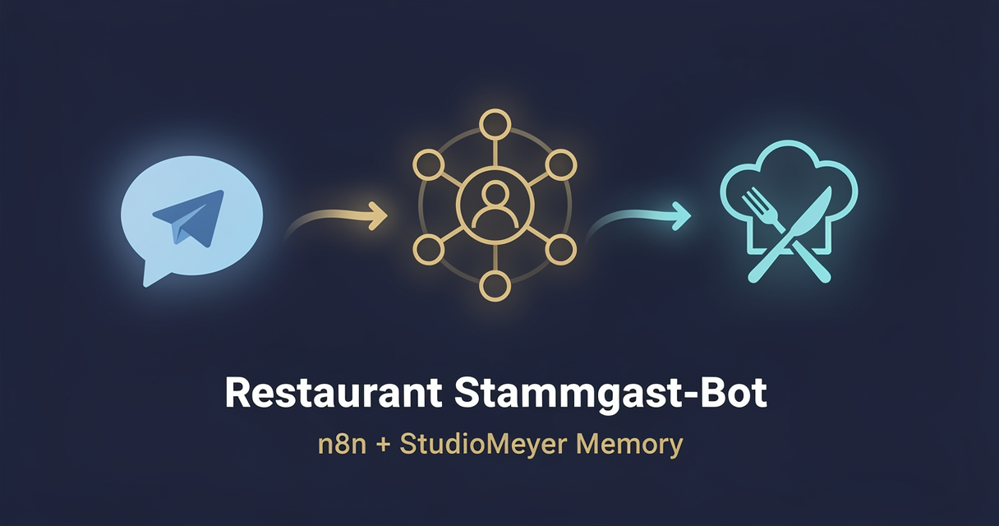

<!-- studiomeyer-mcp-stack-banner:start -->
> **Part of the [StudioMeyer MCP Stack](https://studiomeyer.io)**, Built in Mallorca · ⭐ if you use it
<!-- studiomeyer-mcp-stack-banner:end -->

# Restaurant Stammgast-Bot (Multi-Provider)

> Maria writes "the usual" and the bot knows what that means. Returning regulars get greeted by name and their order history. New guests get a clean welcome and the bot logs them for next time. **Pick your LLM** (OpenAI default, Anthropic alternative).



## What this does

A restaurant guest sends a Telegram message (or WhatsApp, Slack, the trigger is swappable) to your order-bot. The workflow extracts a stable customer key from the message (phone number first, falling back to Telegram contact-share, then user ID, then chat ID), looks up that customer in StudioMeyer Memory, retrieves their order history, and asks Claude or GPT to reply with the dossier as system-prompt context.

After the reply is sent, two async writes persist the new order as an observation on the customer entity and a high-level learning that's searchable across your full guest history. Now you can spot regulars instantly when they message, and your team can search "who ordered paella last Saturday" or "show me everyone who reserved a table for 8 people in the last month" without leaving Memory.

## Architecture

```
[Telegram Trigger]                ← secretToken option = built-in HMAC
        │
        ▼
[Verify Webhook (opt-in)]         ← WEBHOOK_INTEGRITY_CHECK_ENABLED=1
        │
        ▼
[Rate Limit (opt-in)]             ← RATE_LIMIT_ENABLED=1, 60/5min/chat
        │
        ▼
[Idempotency Check (opt-in)]      ← IDEMPOTENCY_ENABLED=1, dedup on update_id
        │
        ▼
[Extract Customer Key]            ← phone regex (E.164), contact-share, then tg-id
        │
        ▼
[Memory: Lookup Customer]         ← entity.search, entityType=customer
        │
        ▼
   ┌──┤ Known Customer? ├──┐
   │                       │
   ▼ yes                  no ▼
[Memory: Customer Dossier]   [Memory: Create Customer]
   (entity.open, full file)   (with first observation)
   │                       │
   └────────┬──────────────┘
            ▼
[Build LLM Prompt]                ← injects dossier + restaurant system prompt
            │
            ▼
[Set Provider] → [Route by Provider]
            ┌────────┴─────────┬─────────┐
            ▼                  ▼         ▼ fallback
   [OpenAI Reply]      [Anthropic Reply]      │
   gpt-5.4-mini default  claude-haiku-4-5     │
   onError: continue   onError: continue      │
   │       │           │       │              │
   ▼       └───────────┘       └──────────────┤
[Normalize LLM Output]                  [LLM Fallback Reply]
   │                                          │
   ▼                                          ▼
[Telegram Reply] ◄────────────────────────────┤
   plus async writes:                         │
   ├─ Memory: Observe Order                   │
   └─ Memory: Learn Order                     ▼
                                       Memory: Learn Error
                                       (category: mistake)
```

The error branch is always wired. The fallback discriminates LLM-error vs router-fallback so the customer's order history never lands in your error audit trail by accident.

## Memory model

| Concept | Storage | Key |
|---|---|---|
| Guest identity | `Entity` of `entityType: customer` | E.164 phone (preferred) or `tg:<user_id>` |
| Per-order detail | `Observation` on the customer entity | timestamp + order or message snippet + bot reply |
| Repeat patterns | `Learning` (category: insight) | tagged with `restaurant` + `customer-<key>` |

The phone-first identity strategy means Maria is recognised whether she messages from her own Telegram, her partner's phone, or shares her contact card. If she does any of those once, the bot links the prior tg-id-based history to the phone-based entity via a separate maintenance workflow (see Extending).

## Setup

1. **Install the StudioMeyer Memory community node** in your n8n instance:
   ```bash
   # Self-hosted
   npm install n8n-nodes-studiomeyer-memory
   # n8n Cloud / hosted: Settings → Community Nodes → Install package: n8n-nodes-studiomeyer-memory
   ```

2. **Create a Telegram bot** via @BotFather, save the token. Configure `/setcommands` so the slash-command UI suggests `/order`, `/reserve`, and `/menu`.

3. **Add credentials in n8n:**
   - StudioMeyer Memory API → API Key from [memory.studiomeyer.io/dashboard/keys](https://memory.studiomeyer.io/dashboard/keys).
   - Telegram → bot token from @BotFather.
   - OpenAI API (default provider) → key from [platform.openai.com](https://platform.openai.com), `gpt-5.4-mini` is the current default mini tier.
   - Anthropic API (alternative provider) → key from [console.anthropic.com](https://console.anthropic.com), `claude-haiku-4-5` is the current Haiku tier.

4. **Import the workflow** (`workflow.json` in this folder).

5. **Open `Build LLM Prompt`** and edit the system prompt to match your restaurant's voice. Replace "S'Olivar in Palma de Mallorca" with your venue name and city.

6. **Activate** the workflow. Telegram automatically registers the webhook.

7. **Test by messaging your bot.** Send a phone number first ("+34611223344, I'd like to book a table tonight for 2"). The first message creates a customer entity. Send a second message ("the usual paella, please") and the bot's reply now references your prior order.

## Multi-provider switch

The workflow ships with two providers wired in parallel: OpenAI `gpt-5.4-mini` (default) and Anthropic `claude-haiku-4-5`. Pick one or run both behind a feature flag.

**Switch from OpenAI to Anthropic:**

1. Open the `Set Provider` node.
2. Change the `provider` field from `openai` to `anthropic`.
3. Save and re-test, the workflow now routes through `Anthropic Reply`.

**Add a third provider (Gemini, Mistral, local Ollama):**

1. Add a new Reply node (e.g. `Gemini Reply`) using whichever credential type fits.
2. Add a new rule in `Route by Provider` that matches `provider == "gemini"` and routes to the new node.
3. On the new Reply node, set `On Error: Continue (Error Output)`. Connect main output 0 to `Normalize LLM Output` and main output 1 to `LLM Fallback Reply`.
4. Update `Normalize LLM Output` to handle the new provider's response shape.
5. Set `provider` to `gemini` in `Set Provider` to test.

The error branch and Memory writes stay identical, you only add nodes, never edit the convergence point.

## Extending

**Link tg-id histories to phone entities.** When a regular finally shares their phone (Telegram contact-share or types it in a message), they were probably already in your DB under `tg:<user_id>`. Add a maintenance workflow that runs daily, finds new phone-based entities, looks up the matching `tg:<user_id>` entity from the same chat, and uses `entity.relate` to merge their observation history. Past tg-only orders now show up in the dossier for new phone-based queries.

**Daily prep brief at 09:00.** Add a Schedule trigger that runs `Memory: Synthesize` with `query: "today's reservations"` every morning and posts the cluster summary to a #kitchen Slack channel or a Telegram group. The kitchen team gets a one-paragraph brief: "8 reservations today, 3 returning regulars (Maria with allergies, Carlos always orders paella, the Schmidts celebrate their anniversary). 2 large groups (8+ people)."

**Auto-detect special diet flags.** When a customer mentions allergies or diet preferences in a message ("I'm vegan" or "no nuts please"), parse with Claude and add an observation tagged `dietary: vegan` or `allergy: nuts` to their entity. The next time they order, the system prompt includes the flag prominently and the LLM remembers without you having to say so.

**Hand off to a human.** Add a sentiment-check IF after the LLM. If the reply suggests escalation (complaint about the food, request for the manager), post the customer's full dossier into a #service Slack channel with a "claim" button. The host on duty takes over with full context instead of asking the same questions again.

## Cost notes

Per order or message the workflow does 4 Memory ops (Lookup + Open or Create + Observe + Learn) plus 1 LLM call. Cost depends on which provider you pick.

| Component | Cost (Stand 2026-05) | Per-order cost |
|---|---|---|
| **StudioMeyer Memory** | EUR 0 / 29 / 49 per month | Free tier: 200 credits (one credit per op, ~50 orders). Pro tier: unlimited. |
| **OpenAI gpt-5.4-mini** (default) | $0.75 / 1M input + $4.50 / 1M output | ~$0.0015 per order (~600 in + 250 out tokens) |
| **Anthropic claude-haiku-4-5** | $1 / 1M input + $5 / 1M output | ~$0.0019 per order |
| Telegram Bot API | free | free |

**Worked example at 500 orders/month (small restaurant):**

| Stack | Memory | LLM | Total |
|---|---|---|---|
| OpenAI gpt-5.4-mini | EUR 0 (Pro tier needed past 200 credits → EUR 29/mo) | ~$0.75/mo | **~EUR 30/mo** |
| Anthropic claude-haiku-4-5 | EUR 29/mo | ~$0.95/mo | **~EUR 30/mo** |

Below 50 orders/month you stay within the free Memory tier (200 credits, one per op) and pay only the LLM (~$0.10/mo). Past that, Pro at EUR 29/mo lifts the cap. Pro tier also unlocks the 3D customer-relationship graph at memory.studiomeyer.io/portal/memory/knowledge.

The error branch fires on LLM failures (rate limit, 5xx). It writes one extra Memory op (Learn Error) per failure. At a healthy 99.5% success rate this adds <0.5% to your bill.

## Common gotchas

- **No phone, no Telegram contact-share.** First-time guests almost always start with just text. The extractor falls back to `tg:<user_id>` and creates an entity under that key. When the customer later shares their phone, the maintenance workflow (see Extending) merges the histories. If you don't run the maintenance workflow, the same regular shows up as two separate entities.
- **Channel posts and forwarded messages.** Telegram channels send messages without a sender ID, only a chat ID. The extractor falls back to `chat:<chat_id>` so all anonymous senders in the same chat collapse into one entity. That's the right behavior for a channel-as-customer setup. If you want strict per-sender separation, drop messages without `message.from.id` upstream.
- **Phone number formats vary.** The regex matches `+34611223344` (E.164) and `0034611223344` (international 00-prefix). It does not match `611223344` (local without country code) because that ambiguates between countries. If your customer base is single-country, relax the regex to also accept the local format and prepend the country code in the extractor.
- **Markdown rendering.** Telegram parses Markdown but only a subset (no tables, limited links). The `parse_mode: Markdown` field works for bold and italic. If you need richer formatting switch to `MarkdownV2` and escape special characters in the reply text.
- **Order confirmation is not order locking.** This template confirms with the customer but does not write the order to your POS. Add an HTTP Request node after `Telegram Reply` that posts to your POS API (Toast, Lightspeed, Square) with the parsed order. Or have the human on duty check the dossier and lock the order in their system.
- **Anthropic node type-string.** The Anthropic Reply node uses `@n8n/n8n-nodes-langchain.anthropic` (the LangChain-vendored direct-API node), not `n8n-nodes-base.anthropic` (which does not exist in n8n core and produces "Unrecognized node type" on activation). The OpenAI counterpart is the core `n8n-nodes-base.openAi`.

## Production patterns

Four patterns ship in `workflow.json` as actual nodes, three opt-in via env vars and one always-on error branch. A fifth pattern, Memory de-duplication, is server-side and needs no workflow node. The opt-in nodes pass through when their env var is unset, so the default import boots clean.

**Idempotency** (opt-in, `IDEMPOTENCY_ENABLED=1`). The `Idempotency Check` Code node holds a 5-minute in-memory window of seen Telegram `update_id` values and short-circuits duplicates. Telegram retries on 5xx so this catches double-fires without touching Memory or the LLM. For clustered n8n deployments, swap the `$getWorkflowStaticData` block for Redis `SET NX EX 300`. The node has the swap pattern in its comments.

**Rate limiting** (opt-in, `RATE_LIMIT_ENABLED=1`). The `Rate Limit` Code node caps each Telegram chat at 60 requests in a 5-minute sliding window. Restaurants don't usually get hammered with chat traffic, but a leaked bot URL or a misbehaving client can spike your LLM bill. The map is bounded at 5 000 entries and evicts expired buckets when full. For real production loads, put rate limiting on a reverse proxy (Nginx `limit_req_zone`, Cloudflare WAF, Traefik) and keep this node as defense-in-depth.

**Webhook security** (opt-in, configured on the trigger). Telegram's `secretToken` mechanism is built into the Telegram Trigger node. Set `additionalFields.secretToken` to a strong random string and re-register the webhook with Telegram's `setWebhook?secret_token=...`. Telegram then sends `X-Telegram-Bot-Api-Secret-Token` on every call and the trigger validates it automatically. The optional `Verify Webhook` Code node downstream (toggled with `WEBHOOK_INTEGRITY_CHECK_ENABLED=1`) is the second defense layer: it rejects malformed payloads that pass HMAC but lack the fields downstream nodes need.

**Error branches** (always on). Both LLM Reply nodes have `On Error: Continue (Error Output)` enabled. The error pin lands at `LLM Fallback Reply`, which builds a graceful customer-facing message and feeds two destinations: `Telegram Reply` (so the customer gets an answer) and `Memory: Learn Error` with `category: mistake, tags: [llm-error, <provider>]`. The fallback handler discriminates between LLM-error and router-fallback so private memory context never leaks into the audit trail. The error syntax is `{{ $json.error.message }}`, not `{{ $error.message }}` (does not exist) and not `{{ $json.execution.error.message }}` (Error Trigger Workflow only, not inline pins).

**Memory de-duplication** (always on, server-side). StudioMeyer Memory's gatekeeper deduplicates writes on >95% content similarity automatically. If your workflow somehow fires twice on the same observation despite idempotency (clock skew, manual re-run), the second write is silently skipped. You can verify by checking `action: SKIPPED, similarity: 1` in the Memory response. This is server-side, no env var needed.

## Hard compatibility floor

**Minimum n8n version with CVE-2026-27493 fix:** >= 2.9.3 (stable channel) / >= 2.10.1 (latest / beta channel) / >= 1.123.22 (1.x LTS). CVE-2026-27493 is an unauthenticated RCE in Form nodes (CVSS 9.5). This template does not use Form nodes itself, but you should still upgrade for general security. The pre-activation check on n8n 2.15.0 was used to validate every node type-string in this template.

## Tech stack matrix

| Component | Version | Cost | Free tier | Required when |
|---|---|---|---|---|
| n8n | >= 2.10.1 (CVE-2026-27493 floor) | self-hosted free / Cloud $20/mo | n8n Cloud trial | always |
| n8n-nodes-studiomeyer-memory | >= 0.1.0 | free | n/a | always |
| StudioMeyer Memory | API key | EUR 0 / 29 / 49 | 200 credits (one per op) | always |
| OpenAI (default) | gpt-5.4-mini | $0.75 / 1M input + $4.50 / 1M output | $5 trial credit | provider = openai |
| Anthropic | claude-haiku-4-5 | $1 / 1M input + $5 / 1M output | $5 trial credit | provider = anthropic |
| Telegram (BotFather token) | latest stable | free | n/a | always |

For WhatsApp Cloud API, swap the Telegram Trigger and Telegram Reply nodes (4 nodes total swap) and use a verified Meta business account. The middle 21 nodes stay identical.

## Credentials checklist

Before activation, create these credentials in n8n:

- [ ] **StudioMeyer Memory API** (`studioMeyerMemoryApi`). Get key at [memory.studiomeyer.io/dashboard/keys](https://memory.studiomeyer.io/dashboard/keys). Test: any memory.search call returns `success: true`.
- [ ] **OpenAI API** (`openAiApi`) OR **Anthropic API** (`anthropicApi`). Get key at [platform.openai.com](https://platform.openai.com) / [console.anthropic.com](https://console.anthropic.com). Test: model list endpoint returns models.
- [ ] **Telegram** (Bot token from @BotFather). After activation, n8n registers the webhook automatically.
- [ ] **Telegram webhook secret token (recommended).** For pre-activation, expand the Telegram Trigger node's `additionalFields` and set `secretToken` to a strong random string. Then re-register the Telegram webhook with the same secret. Telegram sends `X-Telegram-Bot-Api-Secret-Token` on every webhook and the trigger validates it. Without this, the webhook is public-callable by anyone who guesses the URL.

## Live verification

Template 04 inherits the Memory pattern verified live in Template 02 against the production Memory backend at [memory.studiomeyer.io](https://memory.studiomeyer.io) on 2026-04-30 (executions 445 + 446 both green). Structure was validated against n8n 2.15.0: 25 nodes, 16 connections, 0 missing references, all node types recognized by n8n's pre-activation check including the `@n8n/n8n-nodes-langchain.anthropic` type-string for the Anthropic Reply node.

End-to-end execution against your own restaurant requires importing into your n8n, attaching the four credentials (Memory API + OpenAI or Anthropic + Telegram bot), customizing the system prompt in `Build LLM Prompt`, and messaging the bot from Telegram with a phone number in the text or via contact-share.

## Reference deployment

[MenuFlow](https://studiomeyer.io/services/tourismus/menuflow) is the StudioMeyer reference deployment for restaurant bots, including a digital menu, AI-powered chat (Clara), and order routing to the kitchen via Telegram. MenuFlow uses this exact memory pattern with restaurant-specific extensions for menu lookup, allergen flags, and table-management. If you want a fully managed version instead of running this template yourself, MenuFlow ships at EUR 1 800 once + EUR 149 per month.

## How this compares

| Feature | StudioMeyer Memory | Mem0 | Zep | Memori |
|---|---|---|---|---|
| Verified n8n custom node | Yes (this repo, npm provenance) | Community HTTP node | Community node | Third-party node |
| Reference templates ship | 8 templates in this repo | Reddit posts only | Some | None curated |
| Free tier | 200 credits (one per op) | 10K memories + 1K retrieval calls/mo | 1k credits/mo cloud + Graphiti OSS self-host | OSS self-host only |
| E.164-normalized customer key | Yes (`Entity` of `entityType: customer`) | Manual | Manual | Manual |
| Knowledge graph (entities + relations) | Native | Hybrid vector + graph | Native (Graphiti) | Vector only |
| Multi-tenant isolated by default | Yes | Manual config | Manual config | Self-host |
| EU hosting | Yes (Frankfurt, Hetzner) | US-default | US-default | Self-host |

All four projects are open about their tradeoffs. The fastest comparison: wire each one to a throwaway Telegram bot for a day and see which response shape feels right.

## Related templates

- [02 - AI Customer Support with History](../02-customer-support-with-history/) · same memory pattern for general customer support across email-or-id keys
- [05 - Tourist-Bot Repeat-Visitor Recognition](../05-tourist-bot-repeat-visitor/) · web-chat variant with session-based identity
- [01 - Voice Agent Cross-Session Memory](../01-voice-agent-cross-session-memory/) · phone-call variant for voice ordering

---

*Built by [StudioMeyer](https://studiomeyer.io) in Mallorca. Part of the [StudioMeyer MCP Stack](../../README.md). Memory at [memory.studiomeyer.io](https://memory.studiomeyer.io). Issues + ideas at [github.com/studiomeyer-io/n8n-templates/issues](https://github.com/studiomeyer-io/n8n-templates/issues).*
