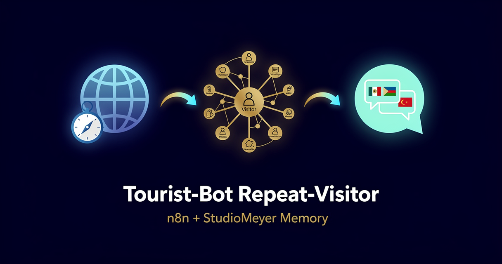

<!-- studiomeyer-mcp-stack-banner:start -->
> **Part of the [StudioMeyer MCP Stack](https://studiomeyer.io)**, Built in Mallorca · ⭐ if you use it
<!-- studiomeyer-mcp-stack-banner:end -->

# Tourist-Bot Repeat-Visitor Recognition (Multi-Provider)

> The visitor asked about Cala Figuera last Tuesday. They came back today. The bot picks up where it left off without forcing a login. **Pick your LLM** (OpenAI default, Anthropic alternative).



## What this does

A web-chat widget on a tourism site or destination-marketing page sends a POST to your n8n webhook when a visitor types a question. The workflow extracts a stable session key (explicit cookie-based session ID first, falling back to a hashed fingerprint of IP + user-agent + accept-language), looks up that key in StudioMeyer Memory, retrieves the visitor's recent sessions, and asks Claude or GPT to reply with the prior context as part of the system prompt.

After the reply is sent, two async writes persist the new session as an observation on the visitor entity and a high-level learning that's searchable across your full visitor corpus. The bot now greets returning visitors with awareness of their last topic ("welcome back, I see you were curious about Cala Figuera, here's what is open today"). Tourism teams can search "what did Spanish-speakers ask most last week" or "which beaches got most attention" without leaving Memory.

## Architecture

```
[Web Chat Webhook]                ← raw body for HMAC, POST /webhook/tourist-chat
        │
        ▼
[Verify Webhook (opt-in)]         ← TOURIST_WEBHOOK_SIGNING_SECRET
        │
        ▼
[Rate Limit (opt-in)]             ← RATE_LIMIT_ENABLED=1, 60/5min/IP
        │
        ▼
[Idempotency Check (opt-in)]      ← IDEMPOTENCY_ENABLED=1, dedup on session+text+minute
        │
        ▼
[Extract Session Key]             ← cookie-session, fingerprint, anonymous-fresh
        │
        ▼
[Memory: Lookup Visitor]          ← entity.search, entityType=customer (visitor scope)
        │
        ▼
   ┌──┤ Returning Visitor? ├──┐
   │                          │
   ▼ yes                     no ▼
[Memory: Visitor Sessions]    [Memory: Create Visitor]
   (entity.open, full file)    (with first session observation)
   │                          │
   └────────┬─────────────────┘
            ▼
[Build LLM Prompt]                ← injects session history + Clara persona
            │
            ▼
[Set Provider] → [Route by Provider]
            ┌────────┴─────────┬─────────┐
            ▼                  ▼         ▼ fallback
   [OpenAI Reply]      [Anthropic Reply]      │
   gpt-5.4-mini default  claude-haiku-4-5     │
   onError: continue   onError: continue      │
   │       │           │       │              │
   ▼       └───────────┘       └──────────────┤
[Normalize LLM Output]                  [LLM Fallback Reply]
   │                                          │
   ▼                                          ▼
[Web Chat Reply] ◄────────────────────────────┤
   plus async writes:                         │
   ├─ Memory: Observe Session                 │
   └─ Memory: Learn Visit                     ▼
                                       Memory: Learn Error
                                       (category: mistake)
```

The error branch is always wired. The fallback discriminates LLM-error vs router-fallback so the visitor's session history never lands in your error audit trail by accident.

## Memory model

| Concept | Storage | Key |
|---|---|---|
| Visitor identity | `Entity` of `entityType: customer` (sub-type via tag `tourist`) | `session:<id>` (explicit) or `fp:<hash>` (fingerprint) |
| Per-session detail | `Observation` on the visitor entity | timestamp + question snippet + bot reply |
| Topic clusters | `Learning` (category: insight) | tagged with `tourism` + `topic-<inferred>` |

The session-first identity strategy means a visitor is recognised whether they switch tabs, clear a cookie within the fingerprint window (~24h), or come back from a different device on the same network. If they ever submit a contact form with email, run a separate maintenance workflow to merge the session-based history into an email-based entity (see Extending).

## Setup

1. **Install the StudioMeyer Memory community node** in your n8n instance:
   ```bash
   # Self-hosted
   npm install n8n-nodes-studiomeyer-memory
   # n8n Cloud / hosted: Settings → Community Nodes → Install package: n8n-nodes-studiomeyer-memory
   ```

2. **Add credentials in n8n:**
   - StudioMeyer Memory API → API Key from [memory.studiomeyer.io/dashboard/keys](https://memory.studiomeyer.io/dashboard/keys).
   - OpenAI API (default provider) → key from [platform.openai.com](https://platform.openai.com), `gpt-5.4-mini` is the current default mini tier.
   - Anthropic API (alternative provider) → key from [console.anthropic.com](https://console.anthropic.com), `claude-haiku-4-5` is the current Haiku tier.

3. **Import the workflow** (`workflow.json` in this folder).

4. **Open `Build LLM Prompt`** and edit the system prompt. Replace "Clara" + "small town in Mallorca" with your destination's voice and locality. Decide whether you want bilingual (DE/EN) or trilingual (DE/EN/ES) replies and adjust the system prompt accordingly.

5. **Wire your web-chat widget** to POST to the production URL of the `Web Chat Webhook` node. Expected payload:
   ```json
   {
     "message": "What is open today at Cala Figuera?",
     "sessionId": "optional-cookie-based-id"
   }
   ```
   The `sessionId` is optional. If absent, the workflow falls back to a hashed fingerprint of IP + user-agent + accept-language. For best repeat-recognition, generate a stable session ID in your frontend on first visit and persist it in a first-party cookie.

6. **Activate** the workflow.

7. **Test** by POSTing twice to the webhook with the same `sessionId`. The second POST's reply now references the first question.

## Multi-provider switch

The workflow ships with two providers wired in parallel: OpenAI `gpt-5.4-mini` (default) and Anthropic `claude-haiku-4-5`. Pick one or run both behind a feature flag.

**Switch from OpenAI to Anthropic:**

1. Open the `Set Provider` node.
2. Change the `provider` field from `openai` to `anthropic`.
3. Save and re-test, the workflow now routes through `Anthropic Reply`.

**Add a third provider (Gemini, Mistral, local Ollama):**

1. Add a new Reply node using the appropriate credential type.
2. Add a new rule in `Route by Provider` that matches `provider == "gemini"` and routes to it.
3. On the new Reply node, set `On Error: Continue (Error Output)`. Connect main output 0 to `Normalize LLM Output` and main output 1 to `LLM Fallback Reply`.
4. Update `Normalize LLM Output` to handle the new provider's response shape.
5. Set `provider` to `gemini` in `Set Provider` to test.

The error branch and Memory writes stay identical, you only add nodes, never edit the convergence point.

## Extending

**Merge fingerprint-based history into email-based entity.** When a visitor submits a contact form with their email, you have a stable identity. Run a maintenance workflow that takes the email, looks up the recent fingerprint-based entity from the same chat session, and uses `entity.relate` to merge their observation history. Past anonymous sessions now show up in the visitor dossier the moment they convert to a known lead.

**Topic-cluster dashboard.** Add a daily Schedule trigger that runs `Memory: Synthesize` with `query: "tourism past-week"` and posts the cluster summary to a #marketing Slack channel. The marketing team gets a one-paragraph weekly view: "182 sessions, top topics: beach access (37%), restaurant recommendations (24%), public transport (18%). Trending: family-friendly itineraries up 14% week-over-week."

**Multi-language detection.** The `Extract Session Key` Code node detects visitor locale from `accept-language`. Persist the detected locale as an observation on the visitor entity and the system prompt then instructs the LLM to default to that language for follow-up sessions, even if the visitor switches devices.

**Reference deployment.** [MallorcaBot](https://mallorcabot.de) is the StudioMeyer reference deployment for tourism bots, integrating this template's repeat-visitor pattern with a 19-POI knowledge graph, a guestbook, and a guided itinerary planner. If you want a fully managed version, MallorcaBot is white-label-able with your destination's content for EUR 1 200 once + EUR 79 per month.

## Cost notes

Per visit the workflow does 4 Memory ops (Lookup + Open or Create + Observe + Learn) plus 1 LLM call. Cost depends on which provider you pick.

| Component | Cost (Stand 2026-05) | Per-visit cost |
|---|---|---|
| **StudioMeyer Memory** | EUR 0 / 29 / 49 per month | Free tier: 200 credits (one credit per op, ~50 visits). Pro tier: unlimited. |
| **OpenAI gpt-5.4-mini** (default) | $0.75 / 1M input + $4.50 / 1M output | ~$0.0017 per visit (~700 in + 250 out tokens) |
| **Anthropic claude-haiku-4-5** | $1 / 1M input + $5 / 1M output | ~$0.0022 per visit |

**Worked example at 2 000 visits/month (small destination site):**

| Stack | Memory | LLM | Total |
|---|---|---|---|
| OpenAI gpt-5.4-mini | EUR 29/mo (Pro tier required past 200 credits) | ~$3.50/mo | **~EUR 33/mo** |
| Anthropic claude-haiku-4-5 | EUR 29/mo | ~$4.50/mo | **~EUR 34/mo** |

Below 50 visits/month you stay within the free Memory tier (200 credits). Past that, Pro at EUR 29/mo lifts the cap. Pro also unlocks the 3D visitor-relationship graph at memory.studiomeyer.io/portal/memory/knowledge.

The error branch fires on LLM failures (rate limit, 5xx). It writes one extra Memory op (Learn Error) per failure. At a healthy 99.5% success rate this adds <0.5% to your bill.

## Common gotchas

- **No sessionId, no IP, no UA.** Some scrapers and broken frontends send empty headers. The extractor falls back to an `anon:<timestamp>` key, which is unique per request. That visitor is treated as new every time. Real users always have at least IP + UA from a normal browser, so the fallback only trips on misconfigured clients.
- **Fingerprint stability is a few days, not weeks.** Visitor IPs rotate (mobile networks, VPNs), user-agents change with browser updates. The fingerprint is good enough for "they came back this week", not for "they came back last month". If you need long-term recognition, push your frontend to set a first-party cookie with a stable session ID on first visit.
- **GDPR + tracking.** Hashed fingerprints from IP + UA are pseudonymous and lawful for legitimate-interest tourism services in the EU as long as you disclose the session-recognition behavior in your privacy policy. If you want to be conservative, set `WEBHOOK_INTEGRITY_CHECK_ENABLED=0` and rely only on explicit `sessionId` from a consent-gated cookie.
- **Visitor in incognito mode.** Each new incognito session has a fresh fingerprint (or none if behind a strict VPN) and counts as a new visitor. That's correct behavior for opt-out users.
- **Web-chat widget posts the wrong shape.** The extractor accepts `body.message`, `body.text`, or `body.question` as the user input. If your widget uses a different field name, edit the extractor or pre-transform in your widget. The error message names the expected field.
- **Anthropic node type-string.** The Anthropic Reply node uses `@n8n/n8n-nodes-langchain.anthropic` (the LangChain-vendored direct-API node), not `n8n-nodes-base.anthropic` (which does not exist in n8n core). The OpenAI counterpart is the core `n8n-nodes-base.openAi`.

## Production patterns

Four patterns ship in `workflow.json` as actual nodes, three opt-in via env vars and one always-on error branch. The opt-in nodes pass through when their env var is unset, so the default import boots clean.

**Idempotency** (opt-in, `IDEMPOTENCY_ENABLED=1`). The `Idempotency Check` Code node holds a 5-minute in-memory window of seen `sessionKey + first-100-chars + minute-bucket` keys and short-circuits duplicates. Web chats do not have a stable replay-id like Telegram does, so this catches a flaky frontend that retries the same query 2-3 times in a row. For clustered n8n deployments, swap the `$getWorkflowStaticData` block for Redis `SET NX EX 300`. The node has the swap pattern in its comments.

**Rate limiting** (opt-in, `RATE_LIMIT_ENABLED=1`). The `Rate Limit` Code node caps each IP at 60 requests in a 5-minute sliding window. Without this, a misbehaving client or a leaked webhook URL spikes your LLM bill. The map is bounded at 5 000 entries with eviction. For real production loads, put rate limiting on a reverse proxy (Nginx `limit_req_zone`, Cloudflare WAF, Traefik) and keep this node as defense-in-depth.

**Webhook HMAC verification** (opt-in, `TOURIST_WEBHOOK_SIGNING_SECRET`). The `Verify Webhook` Code node computes HMAC-SHA256 of the raw body using the configured secret and compares against the `X-Webhook-Signature` header with `crypto.timingSafeEqual`. Length-guard before the timing-safe compare prevents `RangeError` DoS from a 1-char signature. Without HMAC, an attacker who guesses your webhook URL can spike your bill or pollute Memory with junk visits.

**Error branches** (always on). Both LLM Reply nodes have `On Error: Continue (Error Output)` enabled. The error pin lands at `LLM Fallback Reply`, which builds a graceful customer-facing message and feeds two destinations: `Web Chat Reply` (so the visitor gets an answer) and `Memory: Learn Error` with `category: mistake, tags: [llm-error, <provider>]`. The fallback handler discriminates between LLM-error and router-fallback so private memory context never leaks into the audit trail.

**Memory de-duplication** (always on, server-side). StudioMeyer Memory's gatekeeper deduplicates writes on >95% content similarity automatically. Server-side, no env var needed.

## Hard compatibility floor

**Minimum n8n version with CVE-2026-27493 fix:** >= 2.9.3 (stable channel) / >= 2.10.1 (latest / beta channel) / >= 1.123.22 (1.x LTS). CVE-2026-27493 is an unauthenticated RCE in Form nodes (CVSS 9.5). This template does not use Form nodes itself, but you should still upgrade for general security. Pre-activation check on n8n 2.15.0 was used to validate every node type-string.

## Tech stack matrix

| Component | Version | Cost | Free tier | Required when |
|---|---|---|---|---|
| n8n | >= 2.10.1 (CVE-2026-27493 floor) | self-hosted free / Cloud $20/mo | n8n Cloud trial | always |
| n8n-nodes-studiomeyer-memory | >= 0.1.0 | free | n/a | always |
| StudioMeyer Memory | API key | EUR 0 / 29 / 49 | 200 credits (one per op) | always |
| OpenAI (default) | gpt-5.4-mini | $0.75 / 1M input + $4.50 / 1M output | $5 trial credit | provider = openai |
| Anthropic | claude-haiku-4-5 | $1 / 1M input + $5 / 1M output | $5 trial credit | provider = anthropic |
| Web-chat widget | any (Chatwoot, Intercom, custom) | varies | varies | always |

## Credentials checklist

Before activation, create these credentials in n8n:

- [ ] **StudioMeyer Memory API** (`studioMeyerMemoryApi`). Get key at [memory.studiomeyer.io/dashboard/keys](https://memory.studiomeyer.io/dashboard/keys). Test: any memory.search call returns `success: true`.
- [ ] **OpenAI API** (`openAiApi`) OR **Anthropic API** (`anthropicApi`). Get key at [platform.openai.com](https://platform.openai.com) / [console.anthropic.com](https://console.anthropic.com). Test: model list endpoint returns models.
- [ ] **Webhook signing secret (recommended).** Set the n8n env var `TOURIST_WEBHOOK_SIGNING_SECRET` to a strong random string and have your widget sign each request with the same secret using HMAC-SHA256 of the raw body, sent in the `X-Webhook-Signature` header. Without HMAC, an attacker who guesses your webhook URL can spike your bill.

## Live verification

Template 05 inherits the Memory pattern verified live in Template 02 against the production Memory backend at [memory.studiomeyer.io](https://memory.studiomeyer.io) on 2026-04-30 (executions 445 + 446 both green). Structure was validated against n8n 2.15.0: 25 nodes, 16 connections, 0 missing references, all node types recognized.

End-to-end execution against your own destination requires importing into your n8n, attaching the credentials, customizing the system prompt in `Build LLM Prompt`, and POSTing to the webhook from your widget or a curl command.

## How this compares

| Feature | StudioMeyer Memory | Mem0 | Zep | Memori |
|---|---|---|---|---|
| Verified n8n custom node | Yes (this repo, npm provenance) | Community HTTP node | Community node | Third-party node |
| Reference templates ship | 8 templates in this repo | Reddit posts only | Some | None curated |
| Free tier | 200 credits (one per op) | 10K memories + 1K retrieval calls/mo | 1k credits/mo cloud + Graphiti OSS self-host | OSS self-host only |
| Session-based fingerprint identity | Yes (built into this template) | Manual | Manual | Manual |
| Knowledge graph (entities + relations) | Native | Hybrid vector + graph | Native (Graphiti) | Vector only |
| EU hosting + GDPR ready | Yes (Frankfurt, Hetzner) | US-default | US-default | Self-host |

All four projects are open about their tradeoffs. The fastest comparison: wire each one to a throwaway widget for a day and see which response shape feels right.

## Related templates

- [04 - Restaurant Stammgast-Bot](../04-restaurant-stammgast-bot/) · Telegram variant with phone-based customer key
- [02 - AI Customer Support with History](../02-customer-support-with-history/) · Telegram support bot with email-based customer key
- [03 - Personal Assistant with Long-Term Memory](../03-personal-assistant-long-term-memory/) · single-user variant with `synthesize` for cluster summaries

---

*Built by [StudioMeyer](https://studiomeyer.io) in Mallorca. Part of the [StudioMeyer MCP Stack](../../README.md). Memory at [memory.studiomeyer.io](https://memory.studiomeyer.io). Issues + ideas at [github.com/studiomeyer-io/n8n-templates/issues](https://github.com/studiomeyer-io/n8n-templates/issues).*
