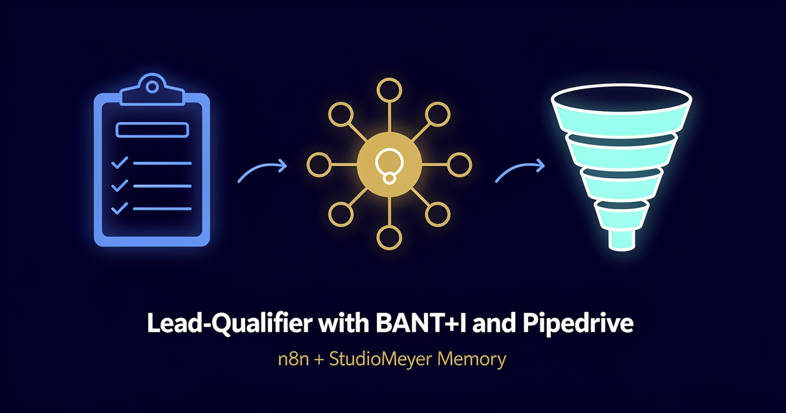

<!-- studiomeyer-mcp-stack-banner:start -->
> **Part of the [StudioMeyer MCP Stack](https://studiomeyer.io)**, Built in Mallorca · ⭐ if you use it
<!-- studiomeyer-mcp-stack-banner:end -->

# Lead-Qualifier with BANT+I and Pipedrive (Multi-Provider)

> A new lead fills out your form. The bot reads their message, scores them on Budget, Authority, Need, Timeline, and Intent, drops the deal into the right Pipedrive stage, and remembers the lead so a returning visitor next month gets re-evaluated against their old BANT score. **Pick your LLM** (OpenAI default, Anthropic alternative).



## What this does

A lead fills out a form on your landing page. The form posts a JSON payload (email, name, company, message) to your n8n webhook. The workflow extracts the lead by email, looks up prior interactions in StudioMeyer Memory, asks Claude or GPT to classify the lead on the BANT+I framework as strict JSON (Budget 1-5, Authority 1-5, Need 1-5, Timeline 1-5, Intent 1-5), buckets the result into hot/warm/cold based on the total, and creates a Pipedrive deal in the matching pipeline stage.

After the deal is created, two async writes persist the BANT scores as observations on the lead entity and a high-level learning that is searchable across your full inbound corpus. Now you can spot returning leads with their prior score, search "which inbound leads from last quarter were warm but never closed", or run a weekly synthesis on your entire pipeline without leaving Memory.

## Architecture

```
[Form Webhook]                    ← raw body for HMAC, POST /webhook/lead-form
        │
        ▼
[Verify Webhook (opt-in)]         ← LEAD_FORM_SIGNING_SECRET
        │
        ▼
[Rate Limit (opt-in)]             ← RATE_LIMIT_ENABLED=1, 60/5min/IP
        │
        ▼
[Idempotency Check (opt-in)]      ← IDEMPOTENCY_ENABLED=1, dedup on email + first-100-chars
        │
        ▼
[Extract Lead]                    ← email, name, company, message, source
        │
        ▼
[Memory: Lookup Lead]             ← entity.search by email
        │
        ▼
   ┌──┤ Returning Lead? ├──┐
   │                       │
   ▼ yes                  no ▼
[Memory: Lead Dossier]    [Memory: Create Lead]
   (entity.open)           (with first BANT observation)
   │                       │
   └────────┬──────────────┘
            ▼
[Build LLM Prompt]                ← injects prior BANT history + structured-JSON instruction
            │
            ▼
[Set Provider] → [Route by Provider]
            ┌────────┴─────────┬─────────┐
            ▼                  ▼         ▼ fallback
   [OpenAI Reply]      [Anthropic Reply]      │
   gpt-5.4-mini default  claude-haiku-4-5     │
   onError: continue   onError: continue      │
   │       │           │       │              │
   ▼       └───────────┘       └──────────────┤
[Normalize LLM Output]                  [LLM Fallback Reply]
   (parses strict-JSON BANT scores)            │
   │                                           │
   ▼                                           ▼
[Form Acknowledge] ◄─────────────────────────┤
   plus async writes:                          │
   ├─ Memory: Observe BANT                     │
   │       │                                   │
   │       └─→ Pipedrive: Create Deal          │
   └─ Memory: Learn Lead-Insight               ▼
                                       Memory: Learn Error
                                       (category: mistake)
```

The error branch is always wired and degrades to a `cold` qualification on parse failure or LLM error so a human reviews instead of a hot lead being silently dropped.

## Memory model

| Concept | Storage | Key |
|---|---|---|
| Lead identity | `Entity` of `entityType: customer` (sub-type via tag `lead`) | normalized email |
| Per-form-submission BANT scores | `Observation` on the lead entity | timestamp + scores JSON + summary |
| Pipeline-level insights | `Learning` (category: insight) | tagged with `lead-pipeline` + `qualified-<bucket>` |

The email-first identity strategy means a returning visitor (same email, new company change) gets re-evaluated against their prior BANT history. The system prompt in `Build LLM Prompt` includes the last 5 observations so the LLM can detect movement ("their need score went from 2 to 4 over six months, the urgency is real now").

## Setup

1. **Install the StudioMeyer Memory community node** in your n8n instance:
   ```bash
   # Self-hosted
   npm install n8n-nodes-studiomeyer-memory
   # n8n Cloud / hosted: Settings → Community Nodes → Install package: n8n-nodes-studiomeyer-memory
   ```

2. **Add credentials in n8n:**
   - StudioMeyer Memory API → API Key from [memory.studiomeyer.io/dashboard/keys](https://memory.studiomeyer.io/dashboard/keys).
   - OpenAI API → key from [platform.openai.com](https://platform.openai.com), `gpt-5.4-mini` is the current default mini tier.
   - Anthropic API (alternative) → key from [console.anthropic.com](https://console.anthropic.com), `claude-haiku-4-5`.

3. **Set Pipedrive env vars** in your n8n environment:
   ```
   PIPEDRIVE_COMPANY_DOMAIN=acme           # the subdomain of your Pipedrive instance
   PIPEDRIVE_API_TOKEN=<your-token>        # from Pipedrive Settings → Personal preferences → API
   PIPEDRIVE_STAGE_HOT=1                   # stage ID for hot leads (Pipedrive: Settings → Pipelines)
   PIPEDRIVE_STAGE_WARM=2                  # stage ID for warm leads
   PIPEDRIVE_STAGE_COLD=3                  # stage ID for cold leads
   ```

4. **Import the workflow** (`workflow.json` in this folder).

5. **Wire your form** to POST to the production URL of the `Form Webhook` node. Expected JSON shape:
   ```json
   {
     "email": "lead@example.com",
     "name": "Jane Doe",
     "company": "Acme GmbH",
     "phone": "+491234567890",
     "message": "We have 50 customer-support agents and want to add AI-assisted replies in Q3.",
     "source": "google-ads"
   }
   ```
   Only `email` and `message` are required.

6. **Activate** the workflow.

7. **Test** by POSTing a sample payload. Verify in Pipedrive that a new deal appeared in the matching stage with BANT scores in the custom fields. Send a second payload from the same email to verify the BANT history is loaded into the prompt.

## Multi-provider switch

The workflow ships with two providers wired in parallel: OpenAI `gpt-5.4-mini` (default) and Anthropic `claude-haiku-4-5`. Pick one or run both behind a feature flag.

**Switch from OpenAI to Anthropic:**

1. Open the `Set Provider` node.
2. Change the `provider` field from `openai` to `anthropic`.
3. Save and re-test.

**Add a third provider (Gemini, Mistral, local Ollama):**

1. Add a new Reply node using the appropriate credential type.
2. Add a new rule in `Route by Provider` matching `provider == "gemini"`.
3. On the new Reply node, set `On Error: Continue (Error Output)`. Connect output 0 to `Normalize LLM Output` and output 1 to `LLM Fallback Reply`.
4. Update `Normalize LLM Output` to handle the new provider's response shape.
5. Set `provider` to `gemini` in `Set Provider` to test.

The error branch and Memory writes stay identical, you only add nodes, never edit the convergence point.

## Extending

**Swap Pipedrive for HubSpot or Salesforce.** Replace the `Pipedrive: Create Deal` HTTP Request node with a HubSpot or Salesforce node. The expected schema is the same: a stage ID + a deal title + custom fields for BANT scores. HubSpot uses `dealstage` instead of `stage_id`, Salesforce uses `StageName`.

**Hot-lead alert to Slack within 60 seconds.** Add an IF node after `Normalize LLM Output` that checks `qualifiedAs == "hot"`. Branch into a Slack incoming-webhook that posts a card with the lead's email, summary, and a "claim" button to a #sales channel. The first available rep claims the lead before it gets cold.

**Re-qualification cadence.** Add a daily Schedule trigger that pulls all leads from Memory tagged `qualified-warm` older than 30 days, posts each one's last message back through the qualifier, and updates the Pipedrive deal stage if BANT score has moved. Warm leads that went cold get archived, warm leads that went hot get a fresh-prio alert.

**Source-attribution view.** Run a weekly `Memory: Synthesize` query for `query: "leads source-utm-source past-month"` and post a one-paragraph attribution summary to your team brief: "32 leads this month, 12 hot. Top sources: Google Ads (8 hot), LinkedIn organic (3 hot), referral (1 hot). Lowest hot-rate: cold-email outbound (0 of 6)."

## Cost notes

Per lead the workflow does 4 Memory ops (Lookup + Open or Create + Observe + Learn) plus 1 LLM call plus 1 Pipedrive API call.

| Component | Cost (Stand 2026-05) | Per-lead cost |
|---|---|---|
| **StudioMeyer Memory** | EUR 0 / 29 / 49 per month | Free tier: 200 credits (one credit per op, ~50 leads). Pro tier: unlimited. |
| **OpenAI gpt-5.4-mini** (default) | $0.75 / 1M input + $4.50 / 1M output | ~$0.0025 per lead (~800 in + 400 out tokens for structured-JSON BANT) |
| **Anthropic claude-haiku-4-5** | $1 / 1M input + $5 / 1M output | ~$0.0036 per lead |
| Pipedrive API | included in Pipedrive subscription | free for existing Pipedrive customers |

**Worked example at 200 leads/month (mid-market B2B SaaS):**

| Stack | Memory | LLM | Total |
|---|---|---|---|
| OpenAI gpt-5.4-mini | EUR 29/mo (Pro tier) | ~$0.50/mo | **~EUR 30/mo** |
| Anthropic claude-haiku-4-5 | EUR 29/mo | ~$0.72/mo | **~EUR 30/mo** |

Below 50 leads/month you stay within the free Memory tier (200 credits, one per op) and pay only the LLM (~$0.50/mo). Past that, Pro at EUR 29/mo lifts the cap. Pro also unlocks the 3D lead-relationship graph at memory.studiomeyer.io/portal/memory/knowledge.

The error branch fires on LLM failures or JSON-parse failures. It writes one extra Memory op (Learn Error) per failure and forces a `cold` Pipedrive stage so a human reviews the lead. At a healthy 99.5% success rate this adds <0.5% to your bill.

## Common gotchas

- **Pipedrive stage IDs differ between accounts.** Each Pipedrive instance has its own pipeline-and-stage IDs. Find them at *Settings → Pipelines → click a stage → URL contains the ID*. The defaults `1, 2, 3` are placeholders. Set the env vars `PIPEDRIVE_STAGE_HOT/WARM/COLD` to your real IDs.
- **LLM does not always return strict JSON.** Despite explicit instructions, GPT and Claude occasionally wrap JSON in fenced code blocks or add a preamble. The `Normalize LLM Output` Code node strips fences and falls back to a `cold` qualification on parse failure. Monitor the `Memory: Learn Error` log for parse-failure-rate over time. If it climbs above 1%, consider switching to a model that supports structured outputs natively (OpenAI's `response_format: { type: "json_schema" }` or Anthropic's tool-use mode).
- **Email normalization.** The `Extract Lead` Code node lowercases email but does not strip dots-before-the-@-in-Gmail or +tags. If your funnel has many `name+jobtitle@gmail.com` style submissions, add `.replace(/\\+[^@]*/, '')` to the email-clean step. Otherwise the same person counts as multiple lead entities.
- **Pipedrive duplicate deals.** This template creates a new Pipedrive deal on every form submission. If a returning lead fills the form twice in two months, you get two open deals. Add an early Pipedrive search by email before `Pipedrive: Create Deal` and update the existing deal's stage instead of creating a new one. The Memory dossier already tells you whether the lead is returning.
- **GDPR + lead data.** Email + company + free-text-message is personal data under GDPR. Make sure your form discloses what is being processed and that StudioMeyer Memory + your Pipedrive instance + your LLM provider are listed as processors. Document your retention policy and use the Memory `data-erasure` API if a lead asks to be forgotten.
- **Anthropic node type-string.** The Anthropic Reply node uses `@n8n/n8n-nodes-langchain.anthropic` (the LangChain-vendored direct-API node), not `n8n-nodes-base.anthropic` (which does not exist in n8n core). The OpenAI counterpart is the core `n8n-nodes-base.openAi`.

## Production patterns

Four patterns ship in `workflow.json` as actual nodes, three opt-in via env vars and one always-on error branch. The opt-in nodes pass through when their env var is unset, so the default import boots clean.

**Idempotency** (opt-in, `IDEMPOTENCY_ENABLED=1`). The `Idempotency Check` Code node holds a 5-minute in-memory window of seen `email + first-100-chars-of-message` keys and short-circuits duplicates. Form double-submits (user clicks Submit twice in 2 seconds, or browser retries on slow network) are caught here. For clustered n8n deployments, swap the `$getWorkflowStaticData` block for Redis `SET NX EX 300`.

**Rate limiting** (opt-in, `RATE_LIMIT_ENABLED=1`). The `Rate Limit` Code node caps each IP at 60 form submissions in a 5-minute sliding window. Critical for public form webhooks: a leaked URL means an attacker can spike both your LLM bill and your Pipedrive deal-count. The map is bounded at 5 000 entries with eviction. For real production loads, put rate limiting on a reverse proxy (Nginx `limit_req_zone`, Cloudflare WAF, Traefik) and keep this node as defense-in-depth.

**Webhook HMAC verification** (opt-in, `LEAD_FORM_SIGNING_SECRET`). The `Verify Webhook` Code node computes HMAC-SHA256 of the raw body using the configured secret and compares against the `X-Webhook-Signature` header. Length-guard before the timing-safe compare prevents `RangeError` DoS. Required if your form is public-facing without a CSRF token.

**Error branches** (always on). Both LLM Reply nodes have `On Error: Continue (Error Output)` enabled. The error pin lands at `LLM Fallback Reply`, which forces a `cold` qualification and sends the lead to manual review. The fallback handler discriminates between LLM-error and router-fallback so private memory context never leaks into the audit trail.

**Memory de-duplication** (always on, server-side). StudioMeyer Memory's gatekeeper deduplicates writes on >95% content similarity automatically. Server-side, no env var needed.

## Hard compatibility floor

**Minimum n8n version with CVE-2026-27493 fix:** >= 2.9.3 (stable channel) / >= 2.10.1 (latest / beta channel) / >= 1.123.22 (1.x LTS). CVE-2026-27493 is an unauthenticated RCE in Form nodes (CVSS 9.5). This template does not use Form nodes itself, but you should still upgrade for general security.

## Tech stack matrix

| Component | Version | Cost | Free tier | Required when |
|---|---|---|---|---|
| n8n | >= 2.10.1 | self-hosted free / Cloud $20/mo | n8n Cloud trial | always |
| n8n-nodes-studiomeyer-memory | >= 0.1.0 | free | n/a | always |
| StudioMeyer Memory | API key | EUR 0 / 29 / 49 | 200 credits (one per op) | always |
| OpenAI (default) | gpt-5.4-mini | $0.75 / 1M input + $4.50 / 1M output | $5 trial credit | provider = openai |
| Anthropic | claude-haiku-4-5 | $1 / 1M input + $5 / 1M output | $5 trial credit | provider = anthropic |
| Pipedrive | API token | included in Pipedrive plan ($14-99/user/mo) | 14-day trial | always |

For HubSpot or Salesforce instead of Pipedrive, swap the `Pipedrive: Create Deal` node and use the corresponding HubSpot Deals or Salesforce Opportunity API.

## Credentials checklist

Before activation, create these credentials in n8n:

- [ ] **StudioMeyer Memory API** (`studioMeyerMemoryApi`). Get key at [memory.studiomeyer.io/dashboard/keys](https://memory.studiomeyer.io/dashboard/keys).
- [ ] **OpenAI API** (`openAiApi`) OR **Anthropic API** (`anthropicApi`).
- [ ] **Pipedrive env vars.** Set `PIPEDRIVE_COMPANY_DOMAIN`, `PIPEDRIVE_API_TOKEN`, `PIPEDRIVE_STAGE_HOT`, `PIPEDRIVE_STAGE_WARM`, `PIPEDRIVE_STAGE_COLD` in your n8n environment.
- [ ] **Form-webhook signing secret (recommended).** Set `LEAD_FORM_SIGNING_SECRET` and have your form sign each request with HMAC-SHA256 of the raw body in `X-Webhook-Signature`.

## Live verification

Template 06 inherits the Memory pattern verified live in Template 02 (executions 445 + 446 both green against memory.studiomeyer.io). Structure was validated against n8n 2.15.0: 26 nodes, 17 connections, 0 missing references, all node types recognized.

End-to-end execution against your own pipeline requires importing into your n8n, attaching the credentials and Pipedrive env vars, customizing the BANT prompt for your industry, and POSTing a sample form payload.

## How this compares

| Feature | StudioMeyer Memory | Mem0 | Zep | Memori |
|---|---|---|---|---|
| Verified n8n custom node | Yes (this repo, npm provenance) | Community HTTP node | Community node | Third-party node |
| Lead-qualifier reference template | Yes (this template) | None | None | None |
| Free tier | 200 credits (one per op) | 10K memories + 1K retrieval/mo | 1k credits/mo cloud | OSS self-host only |
| Email-keyed lead entity | Yes | Manual | Manual | Manual |
| Knowledge graph (entities + relations) | Native | Hybrid vector + graph | Native (Graphiti) | Vector only |
| EU hosting + GDPR ready | Yes (Frankfurt, Hetzner) | US-default | US-default | Self-host |

All four projects are open about their tradeoffs. The fastest comparison: wire each one to a throwaway form for a week and see how recall feels when re-qualifying month-old leads.

## Related templates

- [02 - AI Customer Support with History](../02-customer-support-with-history/) · same memory pattern for general support
- [04 - Restaurant Stammgast-Bot](../04-restaurant-stammgast-bot/) · Telegram variant with phone-based customer key
- [07 - Meeting-Bot with Cross-Meeting Continuity](../07-meeting-bot-cross-meeting-continuity/) · synthesize-based summary for B2B sales-call notes

---

*Built by [StudioMeyer](https://studiomeyer.io) in Mallorca. Part of the [StudioMeyer MCP Stack](../../README.md). Memory at [memory.studiomeyer.io](https://memory.studiomeyer.io). Issues + ideas at [github.com/studiomeyer-io/n8n-templates/issues](https://github.com/studiomeyer-io/n8n-templates/issues).*
