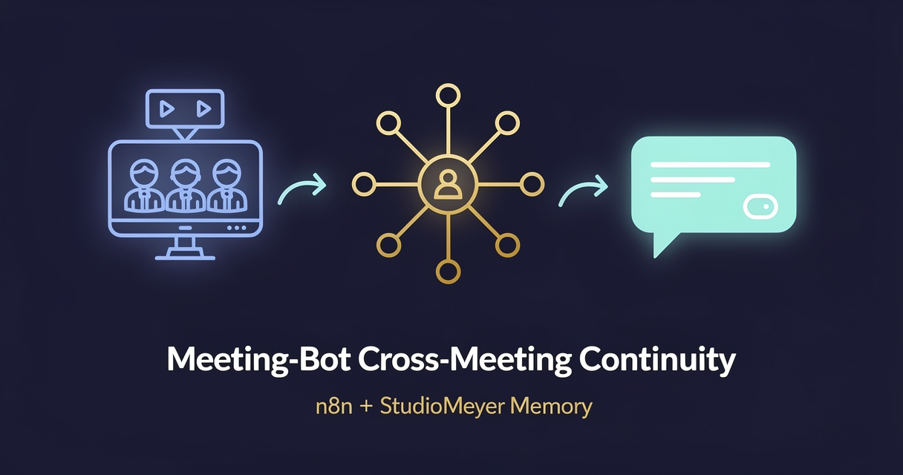

<!-- studiomeyer-mcp-stack-banner:start -->
> **Part of the [StudioMeyer MCP Stack](https://studiomeyer.io)**, Built in Mallorca · ⭐ if you use it
<!-- studiomeyer-mcp-stack-banner:end -->

# Meeting-Bot with Cross-Meeting Continuity (Multi-Provider)

> The same five people met three weeks ago. Now they meet again. The bot summarizes the new meeting against the prior thread and posts to Slack: what is new, what shifted, what action items emerge that did not exist before. **Pick your LLM** (OpenAI default, Anthropic alternative).



## What this does

A meeting platform (Fathom, Otter, Granola, or any provider that fires a webhook on meeting-end) posts a JSON payload with the meeting transcript or summary plus the participant list. The workflow extracts a stable participant-set hash (sorted-emails SHA-256), looks up that set in StudioMeyer Memory, retrieves the last 5 meetings with the same exact participant set, and asks Claude or GPT to synthesize a 4-bullet brief that highlights what is NEW versus what was already discussed.

After the brief is generated, two async writes persist the new meeting as an observation on the participant-set entity and a high-level cross-meeting insight that is searchable across your full meeting corpus. The brief lands in Slack so your team sees it within seconds, and you can later run `/summary client-X` to get a one-paragraph view of every meeting with that client over the last quarter.

## Architecture

```
[Meeting Webhook]                 ← raw body for HMAC, POST /webhook/meeting-end
        │
        ▼
[Verify Webhook (opt-in)]         ← MEETING_WEBHOOK_SIGNING_SECRET
        │
        ▼
[Rate Limit (opt-in)]             ← RATE_LIMIT_ENABLED=1, 60/5min/IP
        │
        ▼
[Idempotency Check (opt-in)]      ← IDEMPOTENCY_ENABLED=1, dedup on meeting_id
        │       │
        │       ▼
        │   [Webhook Acknowledge] ← fast 200 OK back to provider
        │
        ▼
[Extract Meeting Key]             ← detects Fathom / Otter / Granola, hashes participant set
        │
        ▼
[Memory: Lookup Meeting Set]      ← entity.search by participant-set hash
        │
        ▼
   ┌──┤ Recurring Meeting Set? ├──┐
   │                              │
   ▼ yes                         no ▼
[Memory: Meeting History]    [Memory: Create Meeting Set]
   (entity.open, last 5)       (with first observation)
   │                              │
   └────────┬─────────────────────┘
            ▼
[Build LLM Prompt]                ← injects last 5 meetings + cross-comparison instruction
            │
            ▼
[Set Provider] → [Route by Provider]
            ┌────────┴─────────┬─────────┐
            ▼                  ▼         ▼ fallback
   [OpenAI Reply]      [Anthropic Reply]      │
   gpt-5.4-mini default  claude-haiku-4-5     │
   onError: continue   onError: continue      │
   │       │           │       │              │
   ▼       └───────────┘       └──────────────┤
[Normalize LLM Output]                  [LLM Fallback Reply]
   │                                          │
   ▼                                          ▼
[Slack: Post Summary] ◄───────────────────────┤
   plus async writes:                         │
   ├─ Memory: Observe Meeting                 │
   └─ Memory: Learn Cross-Meeting-Insight     ▼
                                       Memory: Learn Error
                                       (category: mistake)
```

The error branch is always wired. The fallback discriminates LLM-error vs router-fallback so the prior meeting context never lands in your error audit trail.

## Memory model

| Concept | Storage | Key |
|---|---|---|
| Recurring meeting set | `Entity` of `entityType: meeting-set` | SHA-256 of sorted lowercase participant emails (16 hex) |
| Per-meeting summary | `Observation` on the meeting-set entity | timestamp + meeting_id + 200-char digest |
| Cross-meeting insights | `Learning` (category: insight) | tagged with `meeting` + `set-<hash>` |

The participant-set strategy means a 1-on-1 with Alex is recognised as the same recurring meeting whether it is in Fathom, Otter, or Granola. A team of 5 meeting again is recognised even if the meeting is renamed or rescheduled. Adding or removing one person creates a new meeting set, which is the right behavior because the conversation context shifts.

## Setup

1. **Install the StudioMeyer Memory community node** in your n8n instance:
   ```bash
   # Self-hosted
   npm install n8n-nodes-studiomeyer-memory
   # n8n Cloud / hosted: Settings → Community Nodes → Install package: n8n-nodes-studiomeyer-memory
   ```

2. **Add credentials in n8n:**
   - StudioMeyer Memory API → API Key from [memory.studiomeyer.io/dashboard/keys](https://memory.studiomeyer.io/dashboard/keys).
   - OpenAI API → key from [platform.openai.com](https://platform.openai.com), `gpt-5.4-mini` is the current default mini tier.
   - Anthropic API (alternative) → key from [console.anthropic.com](https://console.anthropic.com), `claude-haiku-4-5`.

3. **Set Slack webhook URL** in your n8n environment:
   ```
   SLACK_WEBHOOK_URL=https://hooks.slack.com/services/T.../B.../xxx
   ```
   Create the webhook at [api.slack.com/messaging/webhooks](https://api.slack.com/messaging/webhooks) and assign it to the channel where meeting summaries should land (e.g. `#meeting-briefs`).

4. **Import the workflow** (`workflow.json` in this folder).

5. **Wire your meeting platform's webhook:**
   - **Fathom:** Settings → Integrations → Webhooks → New Webhook → URL = production URL of `Meeting Webhook` node, events = `meeting.summarized`.
   - **Otter:** Apps → Webhooks → URL = production URL, events = `transcript_completed`.
   - **Granola:** Settings → Integrations → Webhook URL = production URL.
   - **Generic / custom:** POST a JSON payload with at least `id`, `title`, `transcript` or `summary`, and `participants` (array of emails or objects with `email`).

6. **Activate** the workflow.

7. **Test** by triggering a meeting end. The first meeting creates a meeting-set entity. The second meeting with the same participants now references the first in the Slack brief.

## Multi-provider switch

The workflow ships with two providers wired in parallel: OpenAI `gpt-5.4-mini` (default) and Anthropic `claude-haiku-4-5`. Pick one or run both behind a feature flag.

**Switch from OpenAI to Anthropic:**

1. Open the `Set Provider` node.
2. Change the `provider` field from `openai` to `anthropic`.
3. Save and re-test.

**Add a third provider (Gemini, Mistral, local Ollama):**

1. Add a new Reply node using the appropriate credential type.
2. Add a new rule in `Route by Provider` matching `provider == "gemini"`.
3. On the new Reply node, set `On Error: Continue (Error Output)`. Connect output 0 to `Normalize LLM Output` and output 1 to `LLM Fallback Reply`.
4. Update `Normalize LLM Output` to handle the new provider's response shape.
5. Set `provider` to `gemini` in `Set Provider` to test.

The error branch and Memory writes stay identical, you only add nodes, never edit the convergence point.

## Extending

**Per-client weekly digest.** Add a Schedule trigger that runs every Monday morning. It fires `Memory: Synthesize` with `query: "meeting-set <client-name> past-week"` for each client tag and posts the cluster summary to a #client-briefs Slack channel. Sales gets a one-paragraph weekly view across all client-meetings without anyone manually scrolling through transcripts.

**Auto-tag meetings by topic.** After `Memory: Observe Meeting`, run a small Code node that parses the meeting summary for keywords (pricing, contract, demo, support-issue) and adds them as observation tags. The next time you query `meeting tag:pricing`, you get every meeting where pricing came up across all sets.

**CRM cross-sync.** When the meeting set's participant list contains an external email, look that email up in Pipedrive or HubSpot and post the meeting summary as a Note on the matching deal record. Now your CRM always has the latest meeting context attached automatically.

**Hand off to Linear / Jira on action items.** Parse the action-items section of the LLM output, create a Linear issue or Jira ticket per item with the assignee from the meeting summary. The action items go from words in a Slack thread to tracked work in seconds.

## Cost notes

Per meeting the workflow does 4 Memory ops (Lookup + Open or Create + Observe + Learn) plus 1 LLM call (with up to 5 prior meetings as context).

| Component | Cost (Stand 2026-05) | Per-meeting cost |
|---|---|---|
| **StudioMeyer Memory** | EUR 0 / 29 / 49 per month | Free tier: 200 credits (one credit per op, ~50 meetings). Pro tier: unlimited. |
| **OpenAI gpt-5.4-mini** (default) | $0.75 / 1M input + $4.50 / 1M output | ~$0.005 per meeting (~2k in + 400 out tokens) |
| **Anthropic claude-haiku-4-5** | $1 / 1M input + $5 / 1M output | ~$0.007 per meeting |
| Slack incoming-webhook | free | free |

**Worked example at 100 meetings/month (small B2B sales team):**

| Stack | Memory | LLM | Total |
|---|---|---|---|
| OpenAI gpt-5.4-mini | EUR 29/mo (Pro tier) | ~$0.50/mo | **~EUR 30/mo** |
| Anthropic claude-haiku-4-5 | EUR 29/mo | ~$0.70/mo | **~EUR 30/mo** |

Below 50 meetings/month you stay within the free Memory tier (200 credits). Past that, Pro at EUR 29/mo lifts the cap. Pro also unlocks the 3D meeting-set-relationship graph at memory.studiomeyer.io/portal/memory/knowledge.

The error branch fires on LLM failures (rate limit, 5xx). It writes one extra Memory op (Learn Error) per failure. At a healthy 99.5% success rate this adds <0.5% to your bill.

## Common gotchas

- **Provider auto-detection is heuristic.** The `Extract Meeting Key` Code node looks for distinctive fields (`fathom_id`, `otter_meeting_id`, `granola_id`) to identify the source. If your meeting platform sends a custom shape that does not match any known signal, the extractor falls back to a generic shape that expects `id`, `title`, `transcript`, `summary`, and `participants`. Add your platform's signature as an explicit branch if the generic fallback fails.
- **Participant emails matter, names do not.** The participant-set hash uses lowercase emails. If your platform sends names instead of emails, the hash is built from names, which means the same person across meetings might be represented as different keys ("Alex" vs "Alexander"). Force-normalize names or get email-based participants from your platform.
- **Meeting platforms send transcript-only sometimes.** Some platforms send the full transcript (5-50k tokens), others send a pre-generated summary. The extractor caps transcript at 8 000 chars to avoid blowing up the LLM context. If your meetings need full-transcript analysis, increase the cap and consider a cheaper-model context-summarization step before `Build LLM Prompt`.
- **Slack rate limits.** Slack incoming-webhooks are limited to 1 request per second per webhook. For very high meeting-volume teams (hundreds per day), use the Slack API with a bot token instead.
- **Action items get extracted by the LLM, not parsed structurally.** The bullet-list output of `Build LLM Prompt` is markdown. If you want to push action items as structured data into Linear or Jira, add a follow-up LLM call that re-parses the action items into JSON.
- **Anthropic node type-string.** The Anthropic Reply node uses `@n8n/n8n-nodes-langchain.anthropic` (the LangChain-vendored direct-API node), not `n8n-nodes-base.anthropic` (which does not exist in n8n core). The OpenAI counterpart is the core `n8n-nodes-base.openAi`.

## Production patterns

Four patterns ship in `workflow.json` as actual nodes, three opt-in via env vars and one always-on error branch. The opt-in nodes pass through when their env var is unset, so the default import boots clean.

**Idempotency** (opt-in, `IDEMPOTENCY_ENABLED=1`). The `Idempotency Check` Code node holds a 5-minute in-memory window of seen `meeting_id` values from any of the supported provider shapes (Fathom, Otter, Granola, generic). Meeting platforms re-fire `meeting.summarized` on transient 5xx so this catches double-fires without re-summarizing. For clustered n8n deployments, swap the `$getWorkflowStaticData` block for Redis `SET NX EX 300`.

**Rate limiting** (opt-in, `RATE_LIMIT_ENABLED=1`). The `Rate Limit` Code node caps each IP at 60 webhook fires in a 5-minute sliding window. Without this, a misconfigured meeting-platform integration can spike your LLM bill in minutes. The map is bounded at 5 000 entries with eviction. For real production loads, put rate limiting on a reverse proxy (Nginx `limit_req_zone`, Cloudflare WAF, Traefik) and keep this node as defense-in-depth.

**Webhook HMAC verification** (opt-in, `MEETING_WEBHOOK_SIGNING_SECRET`). The `Verify Webhook` Code node computes HMAC-SHA256 of the raw body using the configured secret and compares against `X-Webhook-Signature` (Fathom, generic), `x-otter-signature` (Otter), or `x-fathom-signature`. Length-guard before the timing-safe compare prevents `RangeError` DoS. Required if your meeting platform's webhook URL might leak (logs, screenshots).

**Error branches** (always on). Both LLM Reply nodes have `On Error: Continue (Error Output)` enabled. The error pin lands at `LLM Fallback Reply`, which builds a degraded brief that says "summarizer is briefly down, please review the transcript manually" and feeds two destinations: `Slack: Post Summary` (so the channel gets a heads-up) and `Memory: Learn Error` with `category: mistake`. The fallback handler discriminates between LLM-error and router-fallback so private memory context never leaks into the audit trail.

**Memory de-duplication** (always on, server-side). StudioMeyer Memory's gatekeeper deduplicates writes on >95% content similarity automatically. Server-side, no env var needed.

**Fast 200-OK acknowledge.** A separate `Webhook Acknowledge` node fires in parallel right after `Idempotency Check` to send a fast 200 OK back to the meeting provider while the LLM summary work happens async. Meeting platforms typically time-out the webhook after 10-30 seconds, and our LLM step can take longer for 5-meeting context windows.

## Hard compatibility floor

**Minimum n8n version with CVE-2026-27493 fix:** >= 2.9.3 (stable channel) / >= 2.10.1 (latest / beta channel) / >= 1.123.22 (1.x LTS). CVE-2026-27493 is an unauthenticated RCE in Form nodes (CVSS 9.5). This template does not use Form nodes itself, but you should still upgrade for general security.

## Tech stack matrix

| Component | Version | Cost | Free tier | Required when |
|---|---|---|---|---|
| n8n | >= 2.10.1 | self-hosted free / Cloud $20/mo | n8n Cloud trial | always |
| n8n-nodes-studiomeyer-memory | >= 0.1.0 | free | n/a | always |
| StudioMeyer Memory | API key | EUR 0 / 29 / 49 | 200 credits (one per op) | always |
| OpenAI (default) | gpt-5.4-mini | $0.75 / 1M input + $4.50 / 1M output | $5 trial credit | provider = openai |
| Anthropic | claude-haiku-4-5 | $1 / 1M input + $5 / 1M output | $5 trial credit | provider = anthropic |
| Fathom or Otter or Granola or Fireflies | latest stable | varies | most have free tier | always |
| Slack incoming-webhook | latest stable | free | n/a | always |

## Credentials checklist

Before activation, create these credentials in n8n:

- [ ] **StudioMeyer Memory API** (`studioMeyerMemoryApi`).
- [ ] **OpenAI API** (`openAiApi`) OR **Anthropic API** (`anthropicApi`).
- [ ] **Slack webhook URL** in env var `SLACK_WEBHOOK_URL`.
- [ ] **Meeting platform webhook signing secret (recommended).** Set `MEETING_WEBHOOK_SIGNING_SECRET` if your platform supports HMAC. Fathom does, Otter does on Pro plans, Granola exposes it on Business plans.

## Live verification

Template 07 inherits the Memory pattern verified live in Template 02 (executions 445 + 446 both green against memory.studiomeyer.io). Structure was validated against n8n 2.15.0: 26 nodes, 16 connections, 0 missing references, all node types recognized.

End-to-end execution requires a Fathom, Otter, Granola, or Fireflies account with webhook capability, a Slack webhook URL, and at least 2 meetings with the same participants for the cross-meeting comparison to fire.

## How this compares

| Feature | StudioMeyer Memory | Mem0 | Zep | Memori |
|---|---|---|---|---|
| Verified n8n custom node | Yes (this repo, npm provenance) | Community HTTP node | Community node | Third-party node |
| Cross-meeting reference template | Yes (this template) | None | None | None |
| Free tier | 200 credits (one per op) | 10K memories + 1K retrieval/mo | 1k credits/mo cloud | OSS self-host only |
| Participant-set entity-keying | Yes (built into this template) | Manual | Manual | Manual |
| Knowledge graph (entities + relations) | Native | Hybrid vector + graph | Native (Graphiti) | Vector only |
| `synthesize` operation | Native | No | No | No |
| EU hosting + GDPR ready | Yes (Frankfurt, Hetzner) | US-default | US-default | Self-host |

The `synthesize` operation is the differentiator for cross-meeting work. `Memory: Synthesize` clusters every observation tagged for a participant set into a coherent paragraph, so a quarterly review across 12 meetings with the same client takes one Memory call instead of 12 LLM calls. No other backend in the comparison ships that as a first-class API.

## Related templates

- [03 - Personal Assistant with Long-Term Memory](../03-personal-assistant-long-term-memory/) · single-user variant with `synthesize` for cluster summaries
- [02 - AI Customer Support with History](../02-customer-support-with-history/) · multi-customer chat variant
- [06 - Lead-Qualifier with BANT+I and Pipedrive](../06-lead-qualifier-pipedrive/) · cross-link from sales-meeting summaries to lead-pipeline scoring

---

*Built by [StudioMeyer](https://studiomeyer.io) in Mallorca. Part of the [StudioMeyer MCP Stack](../../README.md). Memory at [memory.studiomeyer.io](https://memory.studiomeyer.io). Issues + ideas at [github.com/studiomeyer-io/n8n-templates/issues](https://github.com/studiomeyer-io/n8n-templates/issues).*
