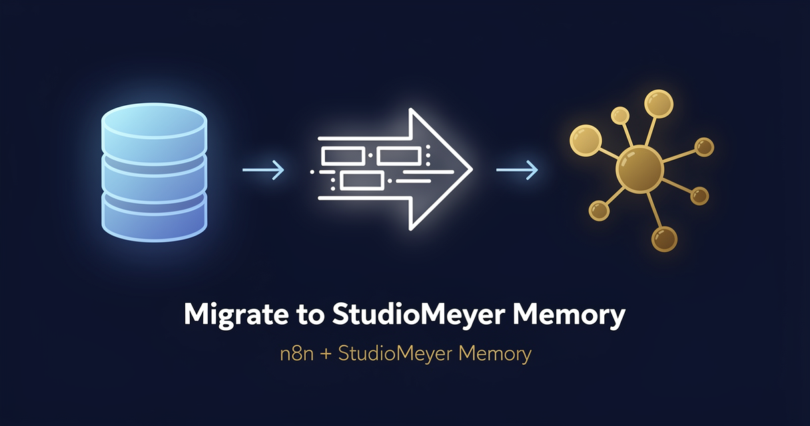

<!-- studiomeyer-mcp-stack-banner:start -->
> **Part of the [StudioMeyer MCP Stack](https://studiomeyer.io)**, Built in Mallorca · ⭐ if you use it
<!-- studiomeyer-mcp-stack-banner:end -->

# Mem0 / Zep Migration to StudioMeyer Memory

> One-shot batch import. Pull every memory out of Mem0 or Zep and into StudioMeyer Memory with idempotency, error reporting, and a migration log. Stop paying for two memory backends. **No LLM provider required**, this is a pure ETL flow.



## What this does

You have a Mem0 or Zep account with months of memories tied to user IDs or session IDs. You want to move to StudioMeyer Memory because the EU hosting fits your GDPR posture, the entity graph is native, or Pro is cheaper than your current Mem0 / Zep tier. This template paginates the source API, normalizes each record into a uniform shape, and batch-writes them as Memory entities, observations, and import-tagged learnings.

The result is a migration log you can audit. Re-run on any failure, the source-id is stored as a tag so duplicates dedupe automatically. After the migration, run a follow-up workflow to re-key entities into proper customer / lead / visitor entities if your source data has structure (Mem0 user_id can map to customer email, Zep session_id to a session entity).

## Architecture

```
[Manual Trigger]
       │
       ▼
[Validate + Configure]            ← reads source (mem0 / zep), userId, limit, env vars
       │
       ▼
[Fetch from Source]               ← Mem0 or Zep API call with pagination params
       │
       ▼
[Normalize Records]               ← uniform shape: { sourceId, content, userId, createdAt, metadata }
       │
       ▼
[Batch Loop] (10 records / batch)
       │
       ▼
[Build Memory Payload]            ← entityName, observationContent, learnContent, tags
       │
       ▼
[Memory: Batch Create Entity]     ← entityType: migrated-memory
       │
       ▼
[Memory: Batch Observe]
       │
       ▼
[Memory: Batch Learn]             ← category: import, tags: [migrated, source-mem0, user-X]
       │
       ▼
   (loop back to Batch Loop)
       │
       ▼ (when batches exhausted)
[Migration Report]                ← totalRecords, successCount, errorCount, durationMs
```

No LLM. No webhook. No multi-provider switch. This is an ETL workflow that runs on demand. Run it once per tenant, save the migration report somewhere, move on.

## Memory model

| Concept | Storage | Key |
|---|---|---|
| Source memory | `Entity` of `entityType: migrated-memory` | `<source>-<source-id-first-32-chars>` |
| Original content | `Observation` on the entity | original record content with timestamp prefix |
| Migration marker | `Learning` (category: import) | tagged `migrated`, `source-<system>`, `user-<id>`, `import-<date>` |

After migration, the entities are grouped by source and user-id via tags. To migrate them into a typed schema (customer / lead / visitor), run a follow-up workflow that searches `tag:migrated tag:user-X`, calls `entity.relate` to merge into a typed parent entity, and removes the `migrated-memory` entityType once you trust the migration.

## Setup

1. **Install the StudioMeyer Memory community node** in your n8n instance:
   ```bash
   # Self-hosted
   npm install n8n-nodes-studiomeyer-memory
   # n8n Cloud / hosted: Settings → Community Nodes → Install package: n8n-nodes-studiomeyer-memory
   ```

2. **Add credentials in n8n:**
   - StudioMeyer Memory API → API Key from [memory.studiomeyer.io/dashboard/keys](https://memory.studiomeyer.io/dashboard/keys), assigned to the destination tenant.

3. **Set source-API env vars** in your n8n environment depending on which source you're migrating from:
   ```
   # Migrating from Mem0
   MEM0_API_KEY=<your-mem0-token-from-app.mem0.ai>

   # Migrating from Zep
   ZEP_API_KEY=<your-zep-api-key-from-app.getzep.com>
   ZEP_PROJECT_ID=<your-zep-project-id>

   # Default scope when source memory has no userId
   MIGRATION_DEFAULT_USER_ID=default-tenant
   ```

4. **Import the workflow** (`workflow.json` in this folder).

5. **Open `Validate + Configure` Code node** to override defaults if needed. The default trigger payload is `{ source: "mem0", userId: "default-tenant", limit: 1000 }`. To migrate Zep, override the input via a Set node before the Manual Trigger or call the workflow with HTTP Trigger and POST `{ "source": "zep", "userId": "alice@example.com", "limit": 5000 }`.

6. **Test with a dry-run first.** Set `limit: 10` in the trigger payload, hit "Execute Workflow", check the Migration Report. Verify in [memory.studiomeyer.io](https://memory.studiomeyer.io) → Knowledge Graph that 10 entities of `entityType: migrated-memory` appeared with the source tags.

7. **Run the full migration.** Set `limit` back to 1000 (or the actual record count of your source). Trigger. The workflow takes ~1 minute per 1 000 records on Memory's free tier (rate-limited to ~100 ops/min).

## Source API mapping

| Source field | Mapped to | Notes |
|---|---|---|
| Mem0 `id` | StudioMeyer `entityName` | format `mem0-<id-first-32-chars>` |
| Mem0 `memory` (text) | observation content | full content, capped at 2000 chars |
| Mem0 `user_id` | tag `user-<id>` | for follow-up entity-relate |
| Mem0 `metadata` | preserved in observation | not currently mapped to entity-properties |
| Mem0 `categories` | preserved in normalize | available for follow-up tagging |
| Zep `uuid` | StudioMeyer `entityName` | format `zep-<uuid-first-32-chars>` |
| Zep `content` (message text) | observation content | full content, capped at 2000 chars |
| Zep `session_id` | tag `user-<session>` | for follow-up entity-relate |
| Zep `role_type` | preserved in observation | preserved as `role` field |

If your source data has fields the normalizer ignores (e.g. Mem0 `agent_id`, Zep custom-properties), edit `Normalize Records` to add them as additional tags or to extend the observation content.

## Follow-up: re-keying migrated entities

After a successful migration you have a flat pool of `migrated-memory` entities. To turn them into proper customer / lead / visitor entities:

```js
// Pseudocode for a follow-up workflow.
// 1. Query Memory: tag:migrated tag:user-acme@example.com
// 2. Build a "parent" entity (entityType: customer) with email as key
// 3. For each migrated-memory entity, use entity.relate to merge observations
//    into the parent entity, then mark the migrated-memory as archived

const sourceUserId = 'acme@example.com';
const migrated = await memory.search({ tags: ['migrated', `user-${sourceUserId}`] });
const parent = await memory.entity.create({
  name: sourceUserId,
  entityType: 'customer',
  tags: ['imported-from-mem0'],
});
for (const m of migrated) {
  await memory.entity.relate({
    sourceName: m.name,
    targetName: parent.name,
    relationType: 'merged-into',
  });
}
```

This step is intentionally a separate workflow. Migration is a single one-time action, re-keying is a per-tenant decision that may need human review.

## Extending

**Resume on rate-limit.** If Mem0 throttles you mid-migration (Free tier is 10 req/s), the `Fetch from Source` node fails fast. Add a Wait node and an IF that checks the response status, retrying with exponential backoff. n8n has a built-in `Retry on Failure` setting on every node that handles 90% of transient failures automatically.

**Per-batch transform.** The `Build Memory Payload` Code node currently maps every record to a uniform shape. To preserve source-specific structure (Mem0 categories, Zep role_types), add a branch that creates additional learnings tagged with the source-specific data. The follow-up re-keying workflow can then use those tags.

**Multi-tenant batch.** If you have 50 Mem0 user_ids to migrate, wrap this workflow in a parent workflow that loops over user_ids and calls Execute Workflow for each. Each migration runs independently with its own report. Aggregating the per-tenant reports gives you a master log.

**Migration verification.** Add a final node that runs `Memory: Search` with `tags: ['migrated', 'import-<today>']` and counts the result. Compare against the `successCount` in the Migration Report. If they don't match, you have a write that succeeded but didn't appear in search yet (Memory's gatekeeper takes ~3 seconds to index embeddings). Wait + retry, then alert if mismatch persists.

## Cost notes

Per migrated record the workflow does 3 Memory ops (Entity Create + Observe + Learn). Source API costs are zero for Mem0 (read is free on all tiers) and Zep (read is included in any plan).

| Component | Cost (Stand 2026-05) | Per-record cost |
|---|---|---|
| **StudioMeyer Memory** | EUR 0 / 29 / 49 per month | Free tier: 200 credits (one credit per op, ~66 records before cap). Pro tier: unlimited. |
| **Mem0 source-API read** | free on all Mem0 plans | free |
| **Zep source-API read** | included in Zep plan | free |

**Worked example at 10 000 records:**

| Stack | Memory | Total |
|---|---|---|
| Free tier (200 credits → ~66 records) | EUR 0 | not enough capacity, switch to Pro |
| Pro (EUR 29/mo) | EUR 29 (one month) | **EUR 29 one-time for the full migration** |

The migration is a one-time op, so even at 100 000 records you only need Pro for one month. After migration, drop back to Free if your steady-state usage is small.

If your source has 1 million records (heavy Mem0 production usage), run in batches and either pay Pro for two months or coordinate with us at [memory.studiomeyer.io/contact](https://memory.studiomeyer.io) for a one-off enterprise migration credit.

## Common gotchas

- **Source API rate limits.** Mem0 free tier throttles to 10 req/s. Zep cloud throttles to 100 req/s. The workflow fetches once per `limit` records (one paginated call), so a single fetch with `limit: 1000` is one API call. Memory writes happen in 10-record batches, which is well below either source's limits.
- **Mem0 returns paginated results.** With `limit > 1000`, you may need to paginate using `?page=N` or `?cursor=...` depending on Mem0's API version. The current template fetches a single page. For >1000 records, wrap `Fetch from Source` in a Loop with cursor-tracking. Check current Mem0 docs at [docs.mem0.ai](https://docs.mem0.ai) for pagination shape.
- **Zep deprecated Community Edition.** As of late 2025, Zep dropped their Community Edition self-host option. Cloud-only and Graphiti-only remain. If you self-hosted Zep CE, your source API endpoint is `localhost` not `api.getzep.com`. Edit the `Validate + Configure` Code node to point at your local Zep instance.
- **Source-id duplicates after re-run.** Memory's gatekeeper deduplicates writes on >95% content similarity, so re-running a migration with the same source data is safe. The second run will mark all observations as `SKIPPED, similarity: 1` in the Memory response. The Migration Report will count them as successCount because the request itself succeeded.
- **Empty content records.** Some source records have only metadata, no actual memory text. The normalizer drops these (`records.filter(r => r.sourceId && r.content)`). If you need to preserve metadata-only records, edit the filter and route them to a dedicated `Memory: Learn` with the metadata in the content field.
- **Migrated-memory entity-type clutters your knowledge graph.** Until you re-key (see Follow-up section), you'll have hundreds or thousands of `migrated-memory` entities in your graph. They're tagged so you can filter them out of normal searches with `NOT tag:migrated`. After re-keying, set them to `archived: true` instead of deleting, so the audit trail stays.

## Production patterns

This is a one-shot migration template, so the production patterns differ from the chat / voice / form templates.

**Idempotency.** Built into Memory's server-side gatekeeper. Re-running this workflow on the same source data is safe. Each entity is keyed by `source-system + source-id`, so duplicates dedupe at write-time.

**Rate limiting.** The source APIs (Mem0, Zep) rate-limit you, and Memory's API rate-limits inbound writes (~100 ops/min on free tier, unlimited on Pro). The Batch Loop with `batchSize: 10` keeps Memory writes under the limit. If you hit Memory's rate limit during a large migration (10 000+ records on free tier), upgrade to Pro for the migration window.

**Error branches.** Each Memory write node has `onError: continueRegularOutput` so a single failed record doesn't kill the whole migration. Errors collect into the Migration Report's `errors` array (capped at 50 in the report) for human review.

**Retry on transient failures.** n8n has a per-node "Retry on Failure" setting. Enable it on `Fetch from Source` (3 retries, exponential backoff) and on each Memory write node (1 retry). The migration will gracefully recover from transient API hiccups.

## Hard compatibility floor

**Minimum n8n version with CVE-2026-27493 fix:** >= 2.9.3 (stable channel) / >= 2.10.1 (latest / beta channel) / >= 1.123.22 (1.x LTS). CVE-2026-27493 is an unauthenticated RCE in Form nodes (CVSS 9.5). This template does not use Form nodes itself, but you should still upgrade for general security.

## Tech stack matrix

| Component | Version | Cost | Free tier | Required when |
|---|---|---|---|---|
| n8n | >= 2.10.1 | self-hosted free / Cloud $20/mo | n8n Cloud trial | always |
| n8n-nodes-studiomeyer-memory | >= 0.1.0 | free | n/a | always |
| StudioMeyer Memory (destination) | API key | EUR 0 / 29 / 49 | 200 credits (one per op) | always |
| Mem0 (source) | API token | free read on all plans | free | source = mem0 |
| Zep (source) | API token | free read on all plans | free | source = zep |

No LLM credentials required. This is pure ETL.

## Credentials checklist

Before activation, create these credentials in n8n:

- [ ] **StudioMeyer Memory API** (`studioMeyerMemoryApi`). Get key at [memory.studiomeyer.io/dashboard/keys](https://memory.studiomeyer.io/dashboard/keys).
- [ ] **Source API key in env vars.** Either `MEM0_API_KEY` (from [app.mem0.ai](https://app.mem0.ai)) or `ZEP_API_KEY` + `ZEP_PROJECT_ID` (from [app.getzep.com](https://app.getzep.com)).
- [ ] **Default user ID** in env var `MIGRATION_DEFAULT_USER_ID` (used as fallback scope).

## Live verification

Template 08 is structurally validated against n8n 2.15.0: 12 nodes, 9 connections, 0 missing references, all node types recognized.

End-to-end execution requires a Mem0 or Zep account with at least one record. Run with `limit: 5` first to verify before committing to a large migration.

## How this compares

| Migration tool | StudioMeyer Memory | Mem0 → Zep migration | Zep → Mem0 migration | Generic ETL |
|---|---|---|---|---|
| n8n template ships | Yes (this repo) | None public | None public | Custom build |
| Idempotent re-run | Yes (gatekeeper at >95% similarity) | Manual dedup logic | Manual dedup logic | Manual |
| Source API mapping | Mem0 + Zep built-in | Manual scripting | Manual scripting | Manual |
| Multi-tenant batch | Loop pattern documented | Manual | Manual | Manual |
| GDPR + EU hosting after migration | Yes (Frankfurt, Hetzner) | US-default | US-default | depends |

This template is the StudioMeyer answer to "I want to leave Mem0 or Zep without writing a script". Distribution-side: this template is a Reddit + Hacker News "Show HN" candidate because the migration whitespace is wide open in 2026.

## Related templates

- [02 - AI Customer Support with History](../02-customer-support-with-history/) · post-migration, re-key migrated-memory entities into customer entities
- [04 - Restaurant Stammgast-Bot](../04-restaurant-stammgast-bot/) · post-migration, re-key into customer entities by phone
- [03 - Personal Assistant with Long-Term Memory](../03-personal-assistant-long-term-memory/) · post-migration, ingest single-user notes into personal-assistant scope

---

*Built by [StudioMeyer](https://studiomeyer.io) in Mallorca. Part of the [StudioMeyer MCP Stack](../../README.md). Memory at [memory.studiomeyer.io](https://memory.studiomeyer.io). Issues + ideas at [github.com/studiomeyer-io/n8n-templates/issues](https://github.com/studiomeyer-io/n8n-templates/issues).*
